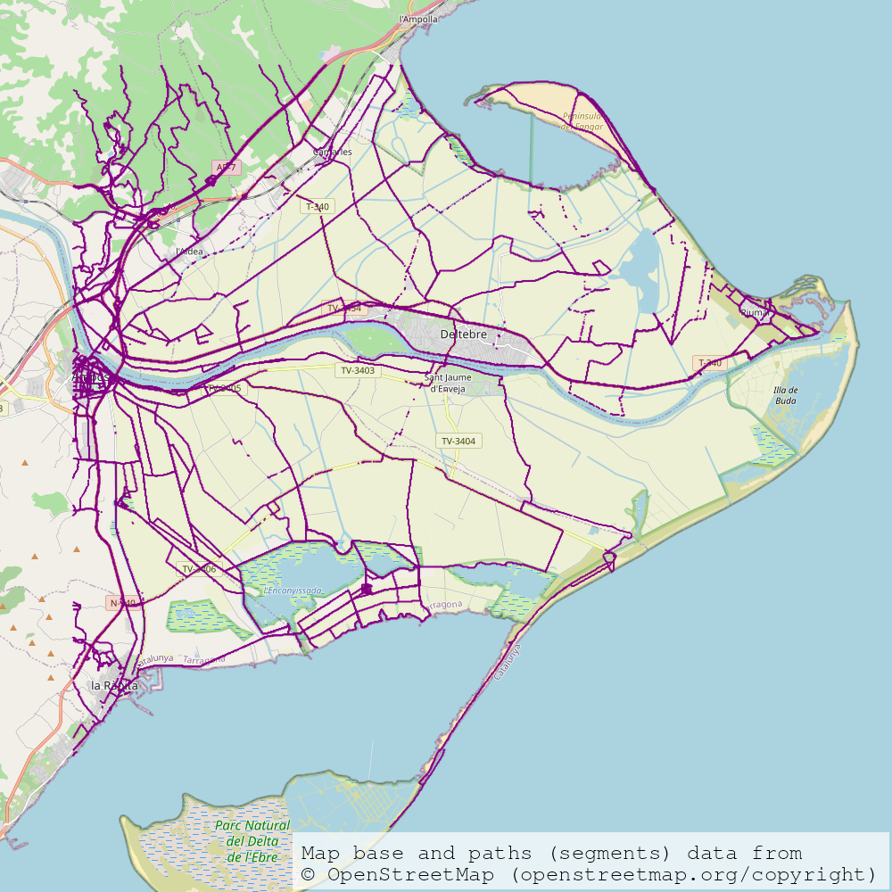
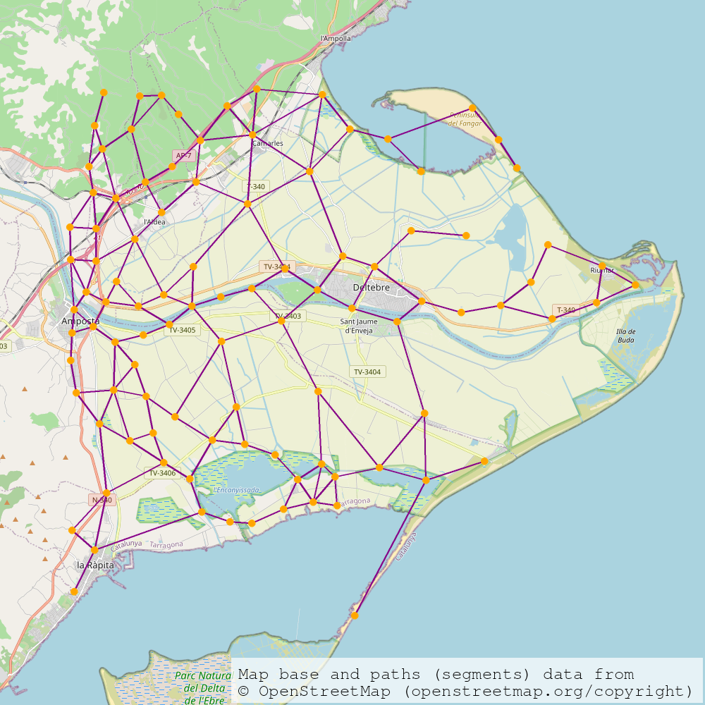
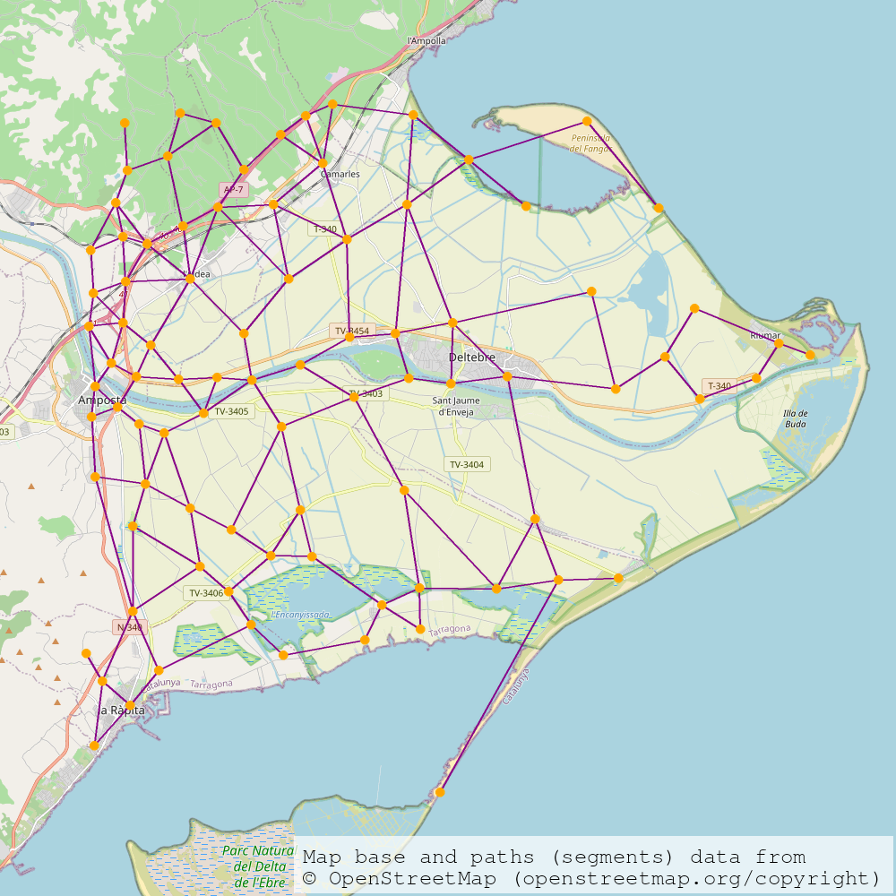
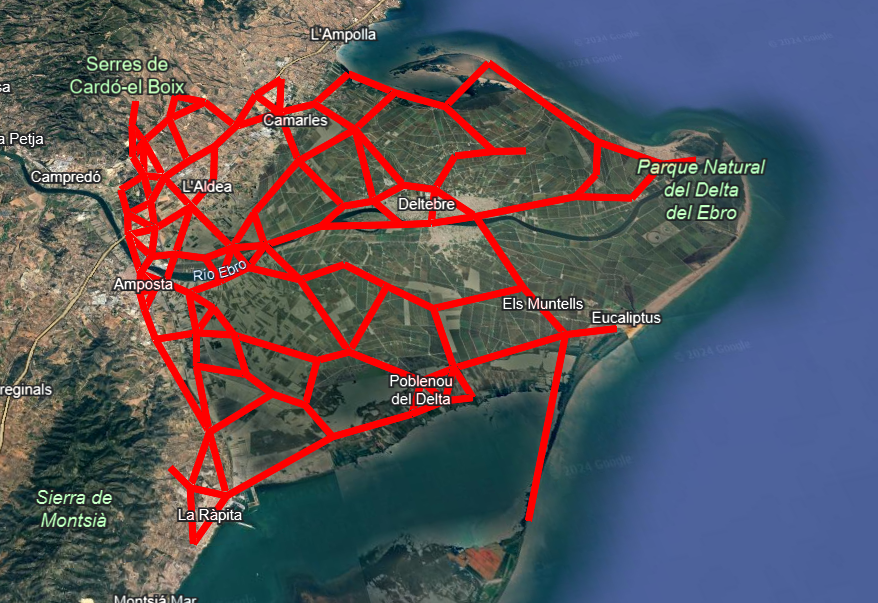
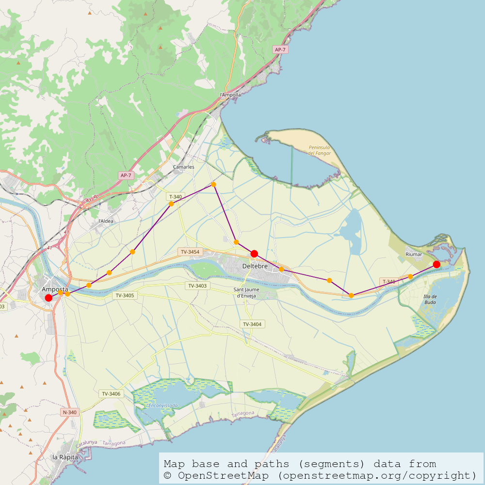

# Testing de Rutes i Monuments

S'han fet tota una sèrie d'arxius per comprovar les funcionalitats i posar a prova l'aplicació. A continuació s'han seleccionat alguns dels més importants i s'ha donat el seu output esperat. És una selecció reduïda, però la majoria de tests comproven funcionalitats que van incloses aquí i alguns han quedat obsolets pels canvis fets.

## Tests de funcionalitats

### test-example-segments.py

En aquest test comprovem la capacitat del programa de descarregar i desar segments, i fer-ho de forma resilient i intel·ligent. Cada cop que descarreguem les dades, comprovarà quines té i quines en falten, i només descarregarà les que faltin. Això inclou poder continuar descarregades interrompudes per errors, o per l'usuari.

```python
# test-example-segments.py

import sys

# Si hem posat el working directory a Rutes_i_Monuments, llavors:
PATH = "./rutes_i_monuments/"

sys.path.append(PATH)

from segments import *
from map_drawing import *

# Define a box around Delta de l'Ebre
P1 = Point(40.5363713, 0.5739316671)
P2 =Point(40.79886535, 0.9021482)
BOX_EBRE_FLOATS = Box(P1, P2)

# Download the segments
segments = get_segments("data/test_datafile_delta_1.dat", BOX_EBRE_FLOATS)

# Export a map from the segments
export_png_map("output/map_delta_segments.png", segments)
```

Output esperat de l'execució el 1r cop, interrompuda:

```
File data/test_datafile_delta_1.dat not found. Downloading the new box's data.
Page 0 has been sorted and added.
Page 1 has been sorted and added.
Page 2 has been sorted and added.
Page 3 has been sorted and added.
Page 4 has been sorted and added.
Page 5 has been sorted and added.
Traceback (most recent call last):
... (Descripció de l'excepció, cauada per fer CTRL C) ...
KeyboardInterrupt
```

Output esperat d'una nova execució:

```
File data/test_datafile_delta_1.dat found.
Looking for box with string 0.5739316671,40.5363713,0.9021482,40.79886535
File data corresponds to this box.
There is some data missing. Downloading the missing data.
Page 6 has been sorted and added.
Page 7 has been sorted and added.
...
Page 115 has been sorted and added.
Page 116 has been sorted and added.
data/test_datafile_delta_1.dat has been saved with the downloaded data.
Loading segments from file data/test_datafile_delta_1.dat.
Done: segments loaded.
Creating map.
Rendering map.
Map has been succesfully saved as output/map_delta_segments.png.
```



Output esperat d'una altra execució havent acabat l'anterior:

```
File data/test_datafile_delta_1.dat found.
Looking for box with string 0.5739316671,40.5363713,0.9021482,40.79886535
File data corresponds to this box.
All data was already gathered.
Loading segments from file data/test_datafile_delta_1.dat.
Done: segments loaded.
Creating map.
Rendering map.
Map has been succesfully saved as output/map_delta_segments.png.
```
S'ha regenerat la imatge, que s'ha de veure pràcticament igual a cada execució.

### test-example-clustering.py

Aquest test comprova que el clustering es fa de forma correcta, i genera tants punts (centroides) com volem a partir dels segments (en aquest cas, 100 punts).

```python
# test-example-clustering.py

import sys

# Si hem posat el working directory a Rutes_i_Monuments, llavors:
PATH = "./rutes_i_monuments/"

sys.path.append(PATH)

from segments import *
from map_drawing import *
from clustering import *

# Define a box around Delta de l'Ebre and get the segments
P1 = Point(40.5363713, 0.5739316671)
P2 =Point(40.79886535, 0.9021482)
BOX_EBRE_FLOATS = Box(P1, P2)
segments = get_segments("data/test_datafile_delta_1.dat", BOX_EBRE_FLOATS)

# Execute a clustering
centroid_labels, centroid_coords, edges, new_segments = cluster(segments, 100)

print(centroid_labels)          # an array of numbers (between 0 and 99)
print(centroid_coords)          # list of (100) points
print(max(centroid_labels))     # 99
print(min(centroid_labels))     # 0
print(len(centroid_coords))     # 100

# Export a map from the clustering
export_png_map("output/map_delta_clustered.png", (new_segments, centroid_coords))
```

Output esperat:
```
File data/test_datafile_delta_1.dat found.
Looking for box with string 0.5739316671,40.5363713,0.9021482,40.79886535
File data corresponds to this box.
All data was already gathered.
Loading segments from file data/test_datafile_delta_1.dat.
Done: segments loaded.
[11 11 11 ... 21 21 21]
[Point(lat=40.72379670573755, lon=0.5912383421399496), Point(lat=40.707727496314156, lon=0.7384342619703756),  ..., Point(lat=40.62138539328047, lon=0.5966158684891485), Point(lat=40.72142145744048, lon=0.7392537183333333)]
99
0
100
Creating map.
Rendering map.
Map has been succesfully saved as output/map_delta_clustered.png.
```


A la llista de punts n'hem omès la majoria i hem posat tres punts "...".

Si tornem a executar el programa hauríem de veure un mapa similar, però amb diferències clarament perceptibles, degut al factor aleatori (o almenys per nosaltres desconegut) del l'agrupament. L'array d'enters i la llista de punts també seran diferents a cada execució.

### test-example-graphmaking.py

Amb aquest test comprovem que el mapa inicial es pot transformar en un graf, cosa que permetrà aplicar algorismes de cerca de rutes. Veurem que se simplifica el graf, ja que alguns vèrtexs innecessaris s'eliminen.

```python
# test-example-graphmaking.py

import sys

# Si hem posat el working directory a Rutes_i_Monuments, llavors:
PATH = "./rutes_i_monuments/"

sys.path.append(PATH)

from segments import *
from map_drawing import *
from graphmaker import *

# Define a box around Delta de l'Ebre and get the segments
P1 = Point(40.5363713, 0.5739316671)
P2 =Point(40.79886535, 0.9021482)
BOX_EBRE_FLOATS = Box(P1, P2)
segments = get_segments("data/test_datafile_delta_1.dat", BOX_EBRE_FLOATS)

# Create a graph from the segments
G = make_graph(segments)

print(G)                # Graph with 100 nodes and 220 edges
print(G.edges)          # list[tuple[int, int]]
print(G.nodes.data())   # list[tuple[int, dict['Point': Point]]]
print(G.edges.data())   # list[tuple[int, int, dict['distance': float]]]

# Export a map from the graph
export_png_map("output/map_delta_graf.png", G)

# Export a KML from the graph
export_kml("output/map_delta_graf.kml", G)
```

Output esperat:
```
File data/test_datafile_delta_1.dat found.
Looking for box with string 0.5739316671,40.5363713,0.9021482,40.79886535
File data corresponds to this box.
All data was already gathered.
Loading segments from file data/test_datafile_delta_1.dat.
Done: segments loaded.
Graph with 88 nodes and 153 edges
[(91, 39), (91, 22), ..., (88, 71)]
[(91, {'point': Point(lat=40.71182561984545, lon=0.5794728957012021)}), (39, {'point': Point(lat=40.71848962580888, lon=0.585530803407503)}), ..., (14, {'point': Point(lat=40.67638317555556, lon=0.7243351533333333)})]    
[(91, 39, {'distance': 0.8998721880410913}), (91, 22, {'distance': 0.9878205568921883}), (91, 63, {'distance': 0.885652689729628}),  ..., (88, 71, {'distance': 2.196071625218686})]
Creating map.
Rendering map.
Map has been succesfully saved as output/map_delta_graf.png.
Creating kml.
KML file has been successfully saved as output/map_delta_graf.kml.
```





- Atribució de les dades de la vista satel·litària:
    - Rutes ressaltades descarregades d'OpenStreetMap (openstreetmap.org/copyright)
    - Google Earth
    - Airbus
    - Data SIO, NOAA, U.S. Navy, NGA, GEBCO
    - Inst. Geogr. Nacional
    - Landsat / Copernicus

S'ha posat tres punts "..." per ometre elements a la llista d'arestes, a la llista de nodes amb els seus punts i a la llista d'arestes amb les seves distàncies. Els elements de les llistes seran diferents a cada execució. De nou, en tornar a executar, el mapa ha de ser similar.

### test-example-routes.py

Aquest test serveix per comprovar que els algorismes efectivament poden trobar rutes a alguns monuments definits i donar l'arbre resultant.

```python
# test-example-routes.py

import sys

# Si hem posat el working directory a Rutes_i_Monuments, llavors:
PATH = "./rutes_i_monuments/"

sys.path.append(PATH)

from segments import *
from map_drawing import *
from graphmaker import *
from monuments import Monument
from routes import _create_tree

# Define a box around Delta de l'Ebre and get the segments
P1 = Point(40.5363713, 0.5739316671)
P2 =Point(40.79886535, 0.9021482)
BOX_EBRE_FLOATS = Box(P1, P2)
segments = get_segments("data/test_datafile_delta_1.dat", BOX_EBRE_FLOATS)

# Create a graph from the segments
G = make_graph(segments)

# Define some monuments
testing_monuments = [   
        Monument("Deltebre", "test", Point(40.72082, 0.71721)),
        Monument("Mirador del Zigurat", "test", Point(40.72304, 0.85995)),
        Monument("Amposta", "test", Point(40.70718, 0.57895))
    ]

# Generate the route tree
start = Point(40.75718, 0.70385)
T = _create_tree(G, start, testing_monuments)

# Export a map from the tree
export_png_map("output/map_delta_routes.png", T)
```

Output esperat:

```
File data/test_datafile_delta_1.dat found.
Looking for box with string 0.5739316671,40.5363713,0.9021482,40.79886535
File data corresponds to this box.
All data was already gathered.
Loading segments from file data/test_datafile_delta_1.dat.
Done: segments loaded.
Creating map.
Rendering map.
Map has been succesfully saved as output/map_delta_routes.png.
```


En tornar a executar, hauríem de veure una imatge similar.

## Tests d'errors

També hem recopilat algunes situacions previstes que poden donar lloc a un error.

### La connexió a internet
Sense connexió a internet, com que el programa necessita accedir a pàgines web, surten errors de connexió i no és possible ni tan sols fer un mapa. Només pots definir un `Box` si ja coneixes les coordenades. Si l'usuari tracta d'executar el codi sense connexió sortirà el següent missatge al terminal:
```
ConnectionError: Connection error. Check internet connection and try again. If error persists, the server where the data is gathered from may be offline, try waiting a few hours.
```

### Una Box no corresponent
En el cas que l'usuari donés una Box no corresponent a l'arxiu de les dades, el programa s'aturarà per a evitar un possible error en els paràmetres de sortida. Si el FEEDBACK_DEFAULT està activat, a la terminal sortirà un missatge explicant l'error i com solucionar-lo:
```
SyntaxError: File data/test_datafile5.dat does not correspond to the box -118.243683,34.052235,-118.243683,34.052235, it corresponds to box 2.7734,41.6578,2.9481,41.7411.
The execution has been stopped to avoid a possible mistake in the parameters input.
In order to rewrtie data/test_datafile5.dat with new data from a different box, please first delete the file.    
If you don't want to overwrite the data, leaving the box parameter empty will get this file's data.
```
### Anomenar monuments a un .dat de la Box
Per a evitar confondre els dos .dat és important que no estiguin anomenats de la mateixa manera. Per això, si l'usuari intenta anomenar monuments a un .dat de la box el programa no el deixarà:
```
FileExistsError: Please, do not name any file data/monuments.dat, as this filename is reserved to monument data gathering. Change filename and try again.
```
### .json inexistent
Si s'elimina el .json quan l'usuari intenta executar, el programa no trobarà l'arxiu que necessita i per evitar problemes amb dades incorrectes s'aturarà:
```
FileNotFoundError: {filename}.json not found. To avoid having incorrect data, please make sure you have not moved the .json out of the working directory. If you have not removed or modified {filename}.json,
you can remove {filename}.dat and download the data again using the same 
filename.
```