# Manual d'usuari de Rutes i Monuments

Aquí tindreu accés a tota la informació sobre com fer servir l'aplicació: instal·lació, execució i funcionalitats.

Com a pas previ a qualsevol execució de codi des de la terminal, assegureu-vos que us trobeu al directori del projecte [Rutes_i_Monuments](../../), on es troba l'arxiu [README.md](../../README.MD). Podeu fer servir la comanda `cd` per arribar-hi (podeu trobar més informació a [Wikipedia](<https://en.wikipedia.org/wiki/Cd_(command)>)).

Com a comentari previ, es demana discreció a l'usuari. És difícil assegurar que els mapes quedaran coherents i no hi haurà camins "impossibles". Això és perquè, en el moment que simplifiquem, sempre modifiquem els camins, i no hi ha manera de saber per on passaran: per sobre de rius, llacs, propietats privades...

L'usuari no ha de posar-se en risc ni entrar a propietats privades digui el que digui aquest programa. Els mapes generats només serveixen per aproximar les rutes; també és probable que no siguin del tot precisos.

## Instal·lació

És necessari tenir les 8 llibreries nomenades a `requirements.txt`, que podeu instal·lar fent servir la comanda `python -m pip install -U -r requirements.txt`, tenint connexió a internet.

Tot i que no és un requisit per començar a executar certes funcions, és convenient començar a descarregar els monuments tan aviat com sigui possible (en el cas que no es disposi inicialment d'ells). Es recomana executar `monuments.py` i deixar-la en segon pla descarregant els monuments.

## Execució

Com a requisit principal es necessita connexió a internet per descarregar les dades i fer mapes (és a dir, les funcions més importants).

L'execució del programa es pot fer de diverses formes, n'en destaquem dues. En ambdues es té accés a una sèrie de funcions que permeten descarregar, processar i visualitzar les dades. Tot seguit entrarem en detall.

La forma més recomanable d'executar Rutes i Monuments és obrir un arxiu i escriure un seguit d'instruccions de Python. D'aquesta manera es poden desar les instruccions per tornar-les a executar, si cal, variant alguns paràmetres. Això serà molt útil per refer els mapes fins a aconseguir un que s'adapti a les nostres necessitats: es pot variar la resolució, el color de les línies... Per fer-ho, simplement s'ha d'escriure a una de les primeres línies `from rutes_i_monuments import *`. Ara tindrem accés a totes les funcions d'aquest mòdul.

Si esteu acostumats a fer servir eines per a programadors, sabreu com veure el "docstring" de les funcions, que us donarà una pista sobre què fan i com s'utilitzen. Però si no és així, tot seguit es descriu tot el que es pot fer amb Rutes i Monuments, i s'ha tractat de fer comprensible per usuaris que no tinguin experiència programant.

Explicarem les funcions fent servir exemples, que estan disponibles a 3 arxius de Python (tutorials) que es poden executar.

Com a comentari previ: moltes funcions estan configurades per donar, per defecte, missatges a la consola explicant què està succeint. Podem desactivar això al mòdul generics.py posant `DEFAULT_FEEDBACK = False`, tot i que no es recomana.

### Funcions principals de rutes_i_monuments.py i exemple d'ús

#### Definició d'una àrea

Podem definir una àrea rectangular per tractar amb les dades que necessitem. Per fer-ho primer haurem de tenir dos punts sobre el globus terraqüi. Per aconseguir-los un possible mètode és: anar a la web de [OpenStreetMap](https://www.openstreetmap.org/), posar el ratolí a un punt del mapa, fer clic dret i clicar a "Mostrar direcció". A l'esquerra de la pantalla se'ns obrirà una petita finestra amb text i una barra de cerca on hi hauran escrits dos nombres que són les coordenades d'aquest punt, en format latitud, longitud. Ens interessa agafar la cantonada esquerra inferior i la cantonada dreta superior. Amb aquests dos punts definim una `Box` que serà la nostra zona de treball.

Per exemple, busquem una àrea al voltant de Blanes, Lloret de Mar i Tossa de Mar.

Cliquem a la cantonada inferior esquerra del que serà el nostre rectangle: veiem que és el punt (41.6578, 2.7734).

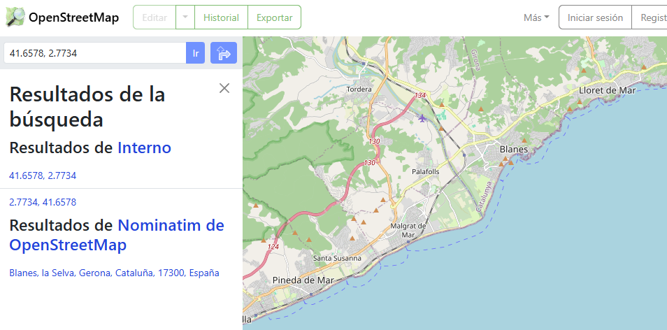

Fem el mateix amb la cantonada dreta superior: cliquem i veiem que és el punt (41.7411, 2.9481).

Fet això, podem definir la nostra `Box`.

`box_costa_selva = Box(Point(41.6578, 2.7734), Point(41.7411, 2.9481))`

Podeu donar-li a la caixa el nom que vulgueu, en aquest cas hem fet servir "box_costa_selva".

#### Mapejat de l'àrea

Abans de seguir, podem veure quina és l'àrea que hem definit i quina és la distància de la seva diagonal. Això és interessant de fer perquè descarregar les dades per mapejar les rutes trigarà bastant, i és convenient que ens assegurem que hem seleccionat l'àrea correcta.

Si estem segurs que l'àrea és correcta, aquest pas ens el podem saltar.

A una línia, escrivim: `preview_box("output/preview-costa_selva.png", box_costa_selva)`

Fixeu-vos: "preview-costa_selva.png" és un nom arbitrari que hem decidit pel mapa que exportarem. Es generarà al directori de treball des d'on executem l'arxiu de Python. L'únic requisit pel nom de l'arxiu és que acabi en ".png", perquè serà una imatge. És molt recomanable posar els arxius en les carpetes "[data](../../data)" o "[output](../../output)". Fixeu-vos que aquestes carpetes ja es troben al directori de l'aplicació [Rutes_i_Monuments](../../).

Després d'executar aquestes dues línies de codi en ordre (definir la caixa i fer el preview), podrem veure aquest mapa:

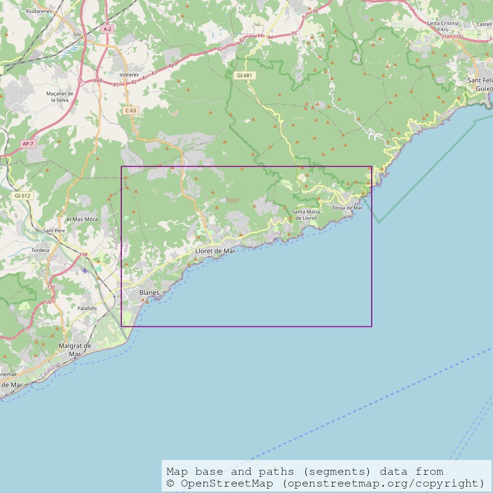

Bé! Aquest rectangle ens servirà.

#### Mapejat dels camins

Una opció que dona el programa és veure una aproximació dels camins per on podem moure'ns, a la zona definida.

Per això farem servir `quick_paths("data/costa_selva", "output/mapa_costa_selva", box_costa_selva)`

Amb aquesta línia generem 3 arxius: un .dat, un .png i un .kml.

- `data/costa_selva.dat` contindrà les dades que necessitem per mapejar la zona. Trigarà una estona en descarregar-se, però es guardarà i no haurem de tornar-ho a fer. A més, podem interrompre l'execució i seguir-la més tard i, en principi, no hauria d'haver-hi cap problema.
- `output/costa_selva.png` serà un mapa de les rutes per on ha passat algun usuari generant dades, i que potser serà transitable (hi ha casos on no, perquè les dades poden ser errònies o potser es tracta d'una autopista o carretera no transitable). Tindrà l'aspecte d'un graf.
- `output/costa_selva.kml` serà un arxiu que podrem pujar a Google Earth per visualitzar el mapa del .png en 3D, poder fer zoom i moure'ns lliurement.

ALERTA: si els arxius amb extensió .png i .kml ja existeixen, es sobreescriuran automàticament. El .dat estarà protegit per aquesta box i no s'esborrarà en cap cas, a menys que l'esborreu manualment (o el programa es comporti de forma inesperada).

En executar-se aquesta última línia de codi, i si tot va bé, la terminal ens començarà a indicar que està descarregant dades. Haurem d'esperar uns minuts, temps que depèn de les característiques del nostre ordinador, principalment, però que no variarà massa. Aquest procés es pot interrompre tancant el programa i, en tornar a executar la línia de codi, seguirà descarregant per on es va quedar. Per tant, no cal fer-ho tot d'una, podeu parar el programa i tornar-ho a executar sense problema.

En acabar, veurem 2 arxius nous.

- El mapa (definit a partir d'un graf i simplificat):

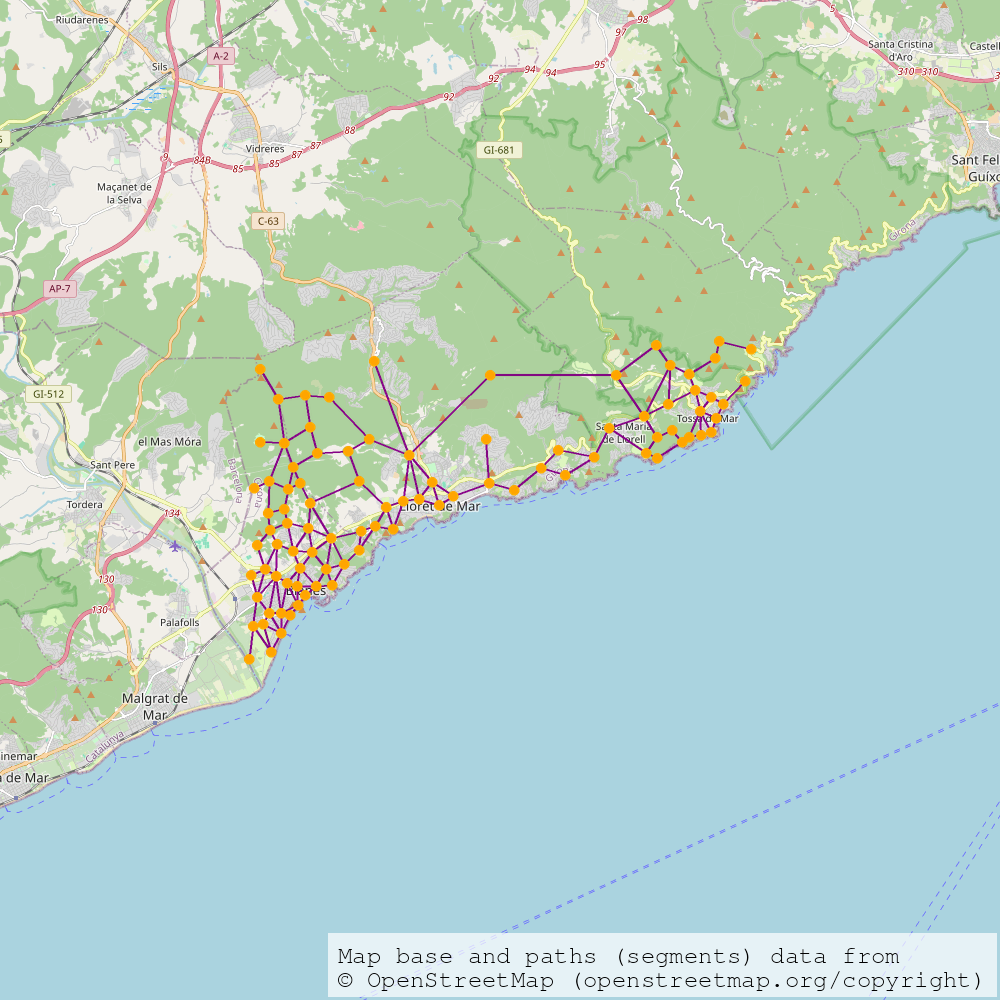

- I l'arxiu KML, que podem importar a Google Earth desplegant amb la fletxa el menú lateral (a l'esquerra de la pantalla), fent clic a "nou", "arxiu KML local", "importar" i seleccionant el nostre arxiu d'extensió .kml. Aquí teniu el resultat:

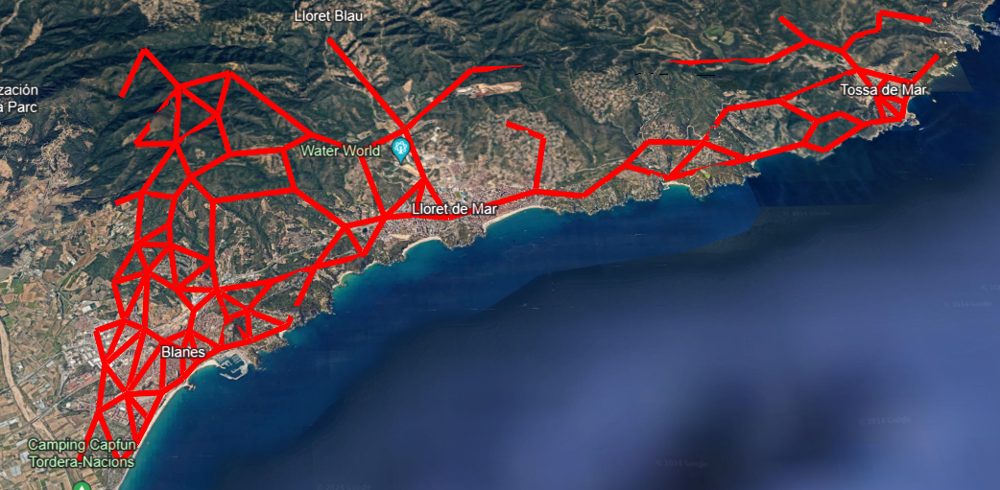
  
- Atribució de les dades de la vista satel·litària:
    - Rutes ressaltades descarregades d'OpenStreetMap (openstreetmap.org/copyright)
    - Google Earth
    - Airbus
    - Data SIO, NOAA, U.S. Navy, NGA, GEBCO
    - Inst. Geogr. Nacional
    - Landsat / Copernicus

Fet això, es poden buscar les rutes a monuments. Es necessita un punt d'inici, que podem aconseguir igual que com s'aconsegueixen les cantonades de la caixa. Llavors, farem servir la comanda següent:

`quick_routes("data/costa_selva", "output/rutes_costa_selva", box_costa_selva, Point(41.70088, 2.83788))`

És important que el primer nom d'arxiu sigui igual que l'anterior, en el cas d'haver fet servir la comanda per fer el mapa. D'aquesta manera s'aprofiten les dades descarregades, del contrari les descarregaríem de nou. És recomanable que el segon nom d'arxiu sí que canviï, per tal de no sobreescriure els mapes fets amb l'anterior comanda.

El resultat és similar, però ara el mapa és reduït, i veiem destacats els monuments a l'arxiu .png.

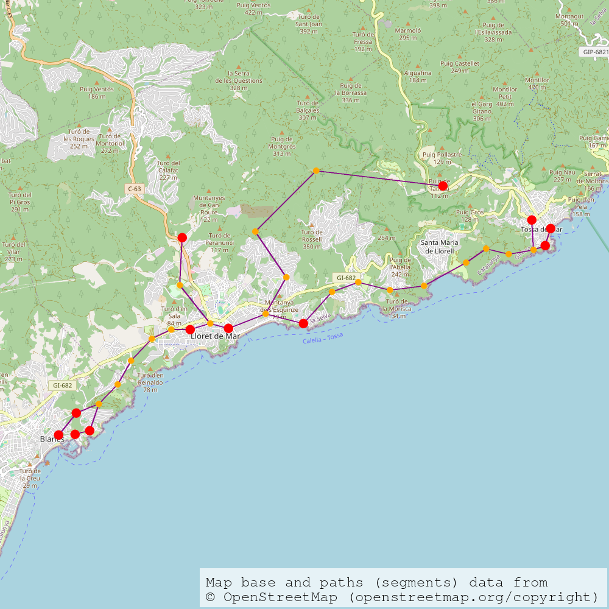

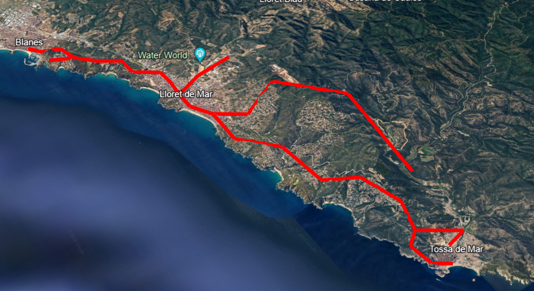

- Atribució de les dades de la vista satel·litària:
    - Rutes ressaltades descarregades d'OpenStreetMap (openstreetmap.org/copyright)
    - Google Earth
    - Airbus
    - Data SIO, NOAA, U.S. Navy, NGA, GEBCO
    - Inst. Geogr. Nacional


Amb aquesta comanda també es donen dos llistats a la terminal, dient quins monuments s'han detectat a aquesta zona i on s'ubiquen. S'ha posat una part dels missatges de la terminal (els tres punts indiquen que s'han omès algunes línies).

```
...
Loading monuments.
Done: monuments loaded.
There are 18 in this box.
These are the monuments and their locations (in latitude - longitude format):
Castell de Blanes (castell) at 41.679485, 2.798287
Castell de Sant Joan (castell) at 41.693878, 2.839405
Castell d’en Plaja (castell) at 41.699505, 2.859592
...
Santuari de la Mare de Déu de les Alegries (esglesia) at 41.717514, 2.829516
Creating the tree.
These are the nodes which contain the reachable monuments:
Node at 41.69847563210676, 2.839046449474323 contains monuments: ['Castell de Sant Joan', 'Capella dels Sants Metges']
Node at 41.68123278558211, 2.8002382386533027 contains monuments: ['Castell de Blanes', 'Torre de Santa Bàrbara']
Node at 41.70204500294539, 2.8524742565146246 contains monuments: ['Església de Sant Romà']
...
Node at 41.71602136079355, 2.831665129455279 contains monuments: ['Santuari de la Mare de Déu de les Alegries']
...
```

Aquestes imatges potser no ens agraden del tot i volem canviar els colors de les línies o punts, la seva mida, l'alçada de les línies al KML, la resolució de la imatge, o la precisió del mapa. Per qualsevol d'aquests canvis s'ha de fer servir la "versió estesa" de les funcions, que permeten treballar amb més precisió i els paràmetres desitjats. A continuació s'explica com es fa això, per tenir un millor control de l'execució.

#### Funcions específiques i exemple d'ús

Suposem que, després de veure el mapa general d'aquesta zona, volem un mapa més específic al voltant de Tossa de Mar perquè la volem visitar. Volem personalitzar el mapa i que, en trobar les rutes, no es torni a generar el graf dels camins, sinó treballar tot d'una amb el mateix mapa. A més a més, volem canviar alguns paràmetres per aconseguir el mapa que ens agradi.

#### Definició d'una llista de Segments i mapejat

Començarem descarregant les dades i posant-les en una variable. Per això necessitem definir la nova `Box` (de pas, la podem visualitzar):

`box_tossa = Box(Point(41.7128, 2.9159), Point(41.7300, 2.9416))`

`preview_box("output/preview-tossa.png", box_tossa)`

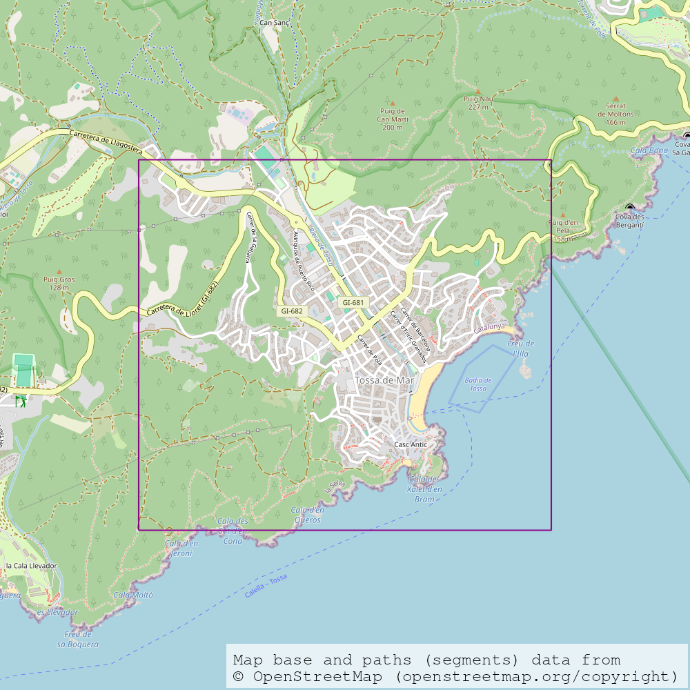

Amb la caixa es pot cridar la funció `get_segments()`, que descarregarà les dades al document del primer paràmetre (que ha de tenir extensió .dat).

`segments_tossa = get_segments("data/tossa.dat", box_tossa)`

Ara, es poden fer servir aquestes dades per fer un mapa amb la "densitat" de quant es transita cada camí:
`export_png_map("output/segments_tossa.png", segments_tossa)`

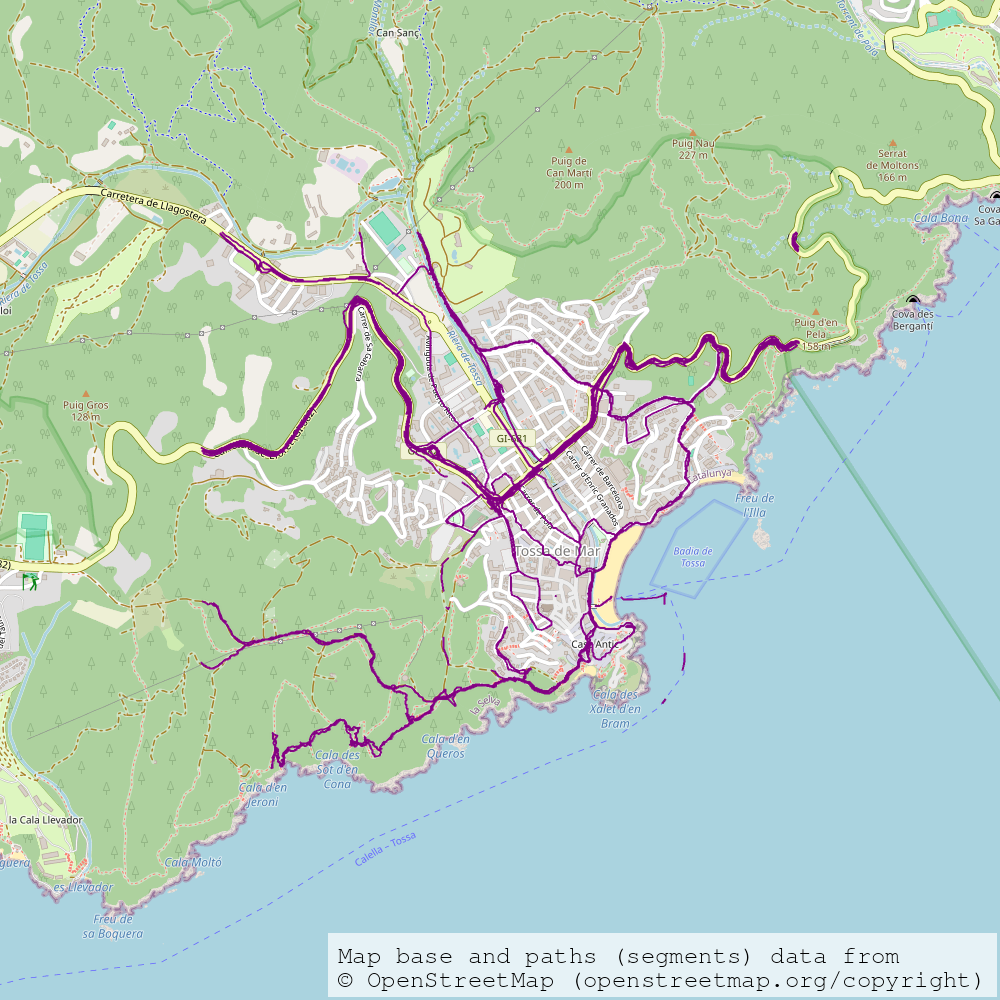

La imatge generada és un mapa amb camins, alguns més gruixuts que altres, que indiquen per on han passat dispositius que han generat dades GPX. Dit d'una altra manera, és un mapa que mostra les rutes i com "d'importants" són. Pot ser útil visualment, però per trobar les rutes als monuments, necessitarem simplificar-lo.

#### Definició d'un objecte de la classe Graf

Amb els segments, definim un graf:

`graf_tossa = make_graph(segments_tossa)`

Amb aquest podem fer diverses coses, per exemple, mapejar-lo:

`export_png_map("output/graf_tossa.png", graf_tossa)`

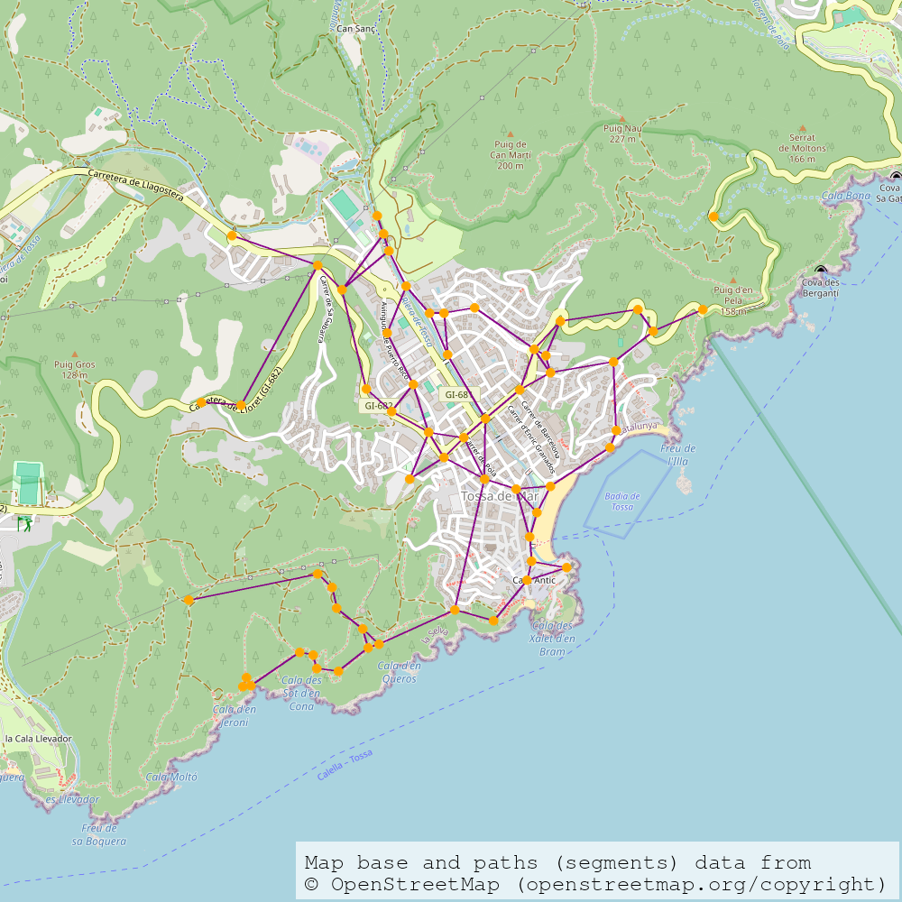

Aquest mapa és potser menys natural que l'altre, és a dir, els camins poden no semblar coherents. Hem perdut precisió, però ara podrem buscar els monuments. Les comandes que podríem fer servir serien les següents:

Primer definim un graf on només quedin els camins d'un punt d'inici a cada monument:

`routes_tossa = find_routes(graf_tossa, box_tossa, (Point(41.7202, 2.9335)))`

I llavors el mapejem:

`export_png_map("output/rutes_tossa.png", routes_tossa)`

`export_kml("output/rutes_tossa.kml", routes_tossa)`

Però abans de buscar els monuments podem modificar el mapa per tal d'aconseguir un que ens agradi més.

#### Definició dels paràmetres

A l'hora de crear el graf, hi ha 3 paràmetres opcionals que podem donar. Més avall s'entra en detall.

Per exemple, podem buscar un mapa més precís que l'anterior, no simplificat i amb 300 clusters:

`graf_tossa = make_graph(segments_tossa, n_clusters=300, simplify=False)`

Prèviament a la creació de mapes personalitzats, es defineixen els paràmetres en dos diccionaris:

```python
colors: dict[str, str] = {
    "line": "blue",
    "marker": "blue",
    "monument": "purple",
    "kml_lines": "ff006400" # darkgreen
}

sizes: dict[str, int] = {
    "map_width": 1500,
    "map_height": 1500,
    "line_width": 5,
    "marker": 5,
    "monument": 20,
    "kml_lines": 10,
    "kml_height": 5
}
```

Els diccionaris han de complir uns requisits importants: han de tenir aquestes claus (és a dir, no ens podem deixar cap paràmetre per definir, de tots els elements a l'esquerra dels dos punts ":") i els valors han de seguir l'esquema donat: allà on hi ha nombres enters, s'ha de posar nombres enters, i on hi ha text, text (a més a més, el color de les línies del KML s'ha de donar en aquest format, es pot trobar més informació a la documentació de [simplekml](https://simplekml.readthedocs.io/en/latest/constants.html#simplekml.ColorMode)).

Definits els paràmetres es poden fer servir per generar mapes personalitzats.

`export_png_map("output/graf_personalitzat_tossa.png", graf_tossa, colors, sizes)`

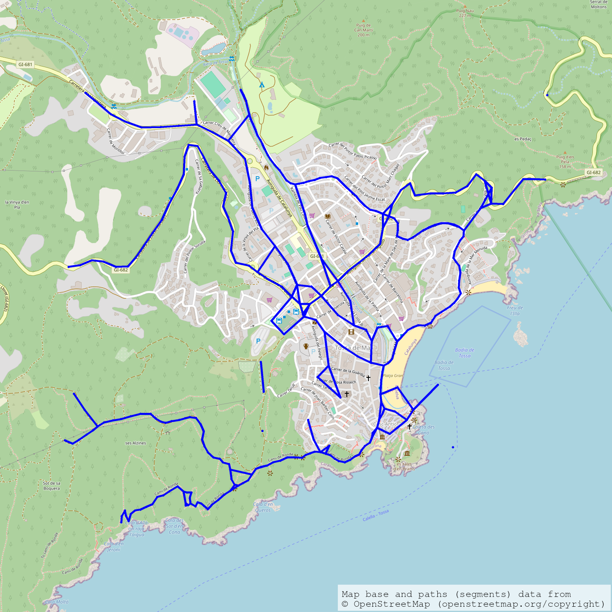

`export_png_map("output/rutes_personalitzat_tossa.png", routes_tossa, colors, sizes)`

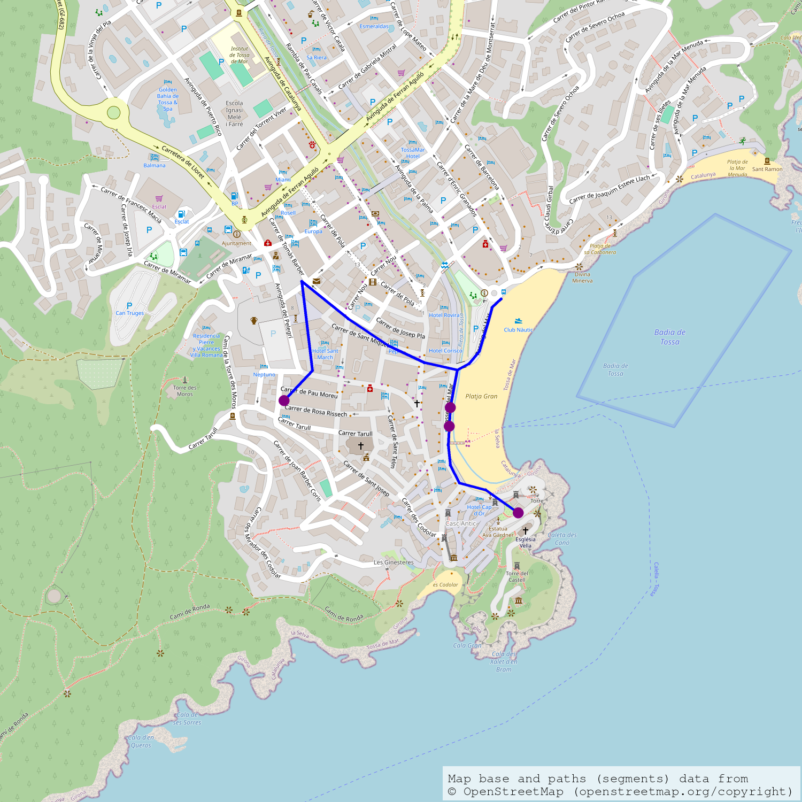

`export_kml("output/rutes_personalitzat_tossa.kml", routes_tossa, colors, sizes)`

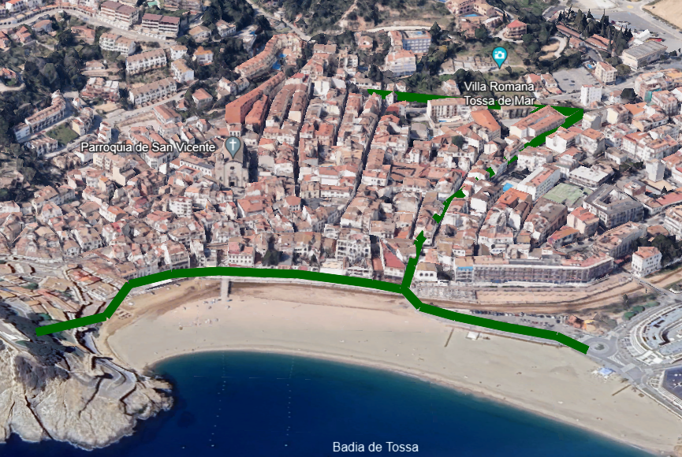

- Atribució de les dades de la vista satel·litària:
    - Rutes ressaltades descarregades d'OpenStreetMap (openstreetmap.org/copyright)
    - Google Earth
    - Airbus
    - Inst. Geogr. Nacional
    - Landsat / Copernicus

Es poden observar les diferències respecte al mapa anterior de Tossa, fet sense personalitzar. Una curiositat interessant és que executar així el programa, a partir de la generació d'un graf inicial en compte d'usar les funcions `quick_paths()` i `quick_routes()`, ens permet generar rutes que estan al mapa inicial. Es pot apreciar com el mapa de rutes és una part agafada del mapa anterior. Usant les funcions ràpides, generem un graf nou cada cop que serà diferent, ja que l'agrupament de punts presenta aleatorietat (a la pràctica, a nivell d'algorisme ho desconeixem).

### Execució "exprés"

Si no volem obrir un document, sinó que simplement volem definir ràpidament una àrea i visualitzar el mapa o les rutes, podem fer servir la consola d'una manera molt similar. Escrivint a la línia de comandes `python -i rutes_i_monuments.py`, iniciem l'intèrpret de Python amb totes les funcions incloses.

D'aquesta manera, podem escriure les comandes una a una sense obrir cap arxiu de Python. Aquest mètode no el recomanem tant com l'altre perquè no es té tanta assistència a l'hora de programar directament al terminal. És més fàcil que ens equivoquem o que ens deixem coses pel camí. Així i tot, per fer coses bàsiques, pot anar bé.

Si executem les línies del document anterior en ordre, hauríem de tenir la mateixa sortida.

### Resum de les funcions accessibles i el seu funcionament

#### Funcions bàsiques

Aquestes funcions permeten escriure un seguit d'instruccions per descarregar i mapejar les dades. En aquestes, tots els paràmetres que siguin arxius han d'incloure l'extensió corresponent.

```Python
def get_segments(filename: str, box: Optional[Box] = None, endpage: int = -1, feedback: bool = DEFAULT_FEEDBACK)
```

Funció per agafar les dades dels segments. filename ha d'incloure l'extensió .dat. Convé establir un valor per endpage només si es pretén fer una prova de les dades i es vol estalviar temps; per tenir precisió és convenient descarregar-les totes. Endpage fa referència a com s'ordenen les dades a la web font.

`get_segments()` protegeix els fitxers .dat de ser sobreescrits. Si estan accessibles, comprovarà que, en cas d'haver donat una caixa com a paràmetre, sigui la caixa que correspon a aquestes dades. En cas contrari, saltarà un error. Si no donem cap caixa, ens retornarà les dades directament. Sempre comprovarà que s'hagin descarregat les dades demanades i descarregarà les que faltin.

L'usuari pot saber a quina box pertany un arxiu .dat. S'ha d'accedir a l'arxiu .json amb el mateix nom i llegir el paràmetre `box_str`. Aquest conté els dos punts en format longitud - latitud (la coma al mig separa els dos punts, les altres dos comes separen longitud de latitud a cada punt).

```Python
def export_png_map(
        filename: str,
        data: Graph | Segments | tuple[Segments, list[Point]],
        colors: dict[str, str] = DEFAULT_COLORS,
        sizes: dict[str, int] = DEFAULT_SIZES,
        feedback: bool = DEFAULT_FEEDBACK
    ) -> None:

def export_kml(
        filename: str,
        G: Graph,
        colors: dict[str, str] = DEFAULT_COLORS,
        sizes: dict[str, int] = DEFAULT_SIZES,
        feedback: bool = DEFAULT_FEEDBACK
    ) -> None:
```

Funcions per exportar mapes en format png i KML. La primera accepta grafs, segments o una tupla de segments i punts; mentre que la segona només grafs. El paràmetre `filename` ha d'incloure l'extensió corresponent (.png o .kml). Els dos diccionaris han de contenir totes les següents claus:

```python
colors: dict[str, str] = {
    "line": "purple",
    "marker": "orange",
    "monument": "red",
    "kml_lines": "ff0000ff" # red
}
"""Dictionary to set colors for map and KML creation."""

sizes: dict[str, int] = {
    "map_width": 1000,
    "map_height": 1000,
    "line_width": 2,
    "marker": 10,
    "monument": 15,
    "kml_lines": 5,
    "kml_height": 15
}
```

Aquests són els valors per defecte. Convé no allunyar-s'hi massa, ja que si apliquem una raó de multiplicar per 10 qualsevol valor podem començar a notar problemes. Igualment, si perdem la proporció entre els valors, també pot causar problemes. En qualsevol cas, l'usuari pot experimentar amb modificar els valors i si el programa sembla congelar-se o salten errors estranys, pot deixar les variables com estaven.

Els colors disponibles per fer exportar mapes en PNG són els del mòdul [Pillow](https://stackoverflow.com/questions/54165439/what-are-the-exact-color-names-available-in-pils-imagedraw).

Per KML s'ha de col·locar el valor hexadecimal, però no és el format estàndard. Es pot trobar una guia sobre com posar cada color a la documentació de [simplekml](https://simplekml.readthedocs.io/en/latest/constants.html#simplekml.ColorMode).

```python
def make_graph(segments: Segments, n_clusters: int = DEFAULT_N_CLUSTERS, simplify: bool = True, epsilon: float = DEFAULT_EPSILON) -> Graph:
```

Funció per generar un graf a partir d'uns segments. Té tres paràmetres opcionals. `n_clusters` és el nombre de clusters (agupacions) que es faran, per defecte són 100. Reduir el nombre farà el mapa més simple, augmentar-lo el farà més precís, però amb el risc que alguns camins no es mostrin a causa de tenir unes dades inicials poc precises (és millor no elevar massa aquest nombre per no desconnectar el mapa). Succeeix l'invers amb el paràmetre `epsilon`, l'angle per simplificar, que és l'angle mínim que es permetrà entre les 2 úniques arestes de qualsevol node amb dos veïns (serveix per eliminar nodes que no siguin necessaris per connectar camins). De fet, podem no simplificar el graf, establint el paràmetre `simplify` com False. Aquest paràmetre no causarà cap problema de desconnectar el mapa.

```python
def find_routes(G: Graph, box: Box, start: Point, feedback: bool = DEFAULT_FEEDBACK) -> Graph:
```

Funció per reduir un graf a un arbre, on l'arrel és el punt `start` i les fulles seran els nodes als monuments. Tant `start` com cada monument s'aproxima al node més proper. Necessita l'entrada de la caixa on volem buscar els monuments. És important que aquesta caixa sigui similar a la que s'ha fet servir per descarregar els segments i fer el graf, del contrari, podem perdre monuments o trobar monuments que no estan a la caixa.

#### Funcions extres

Aquestes funcions permeten fer certes coses més de pressa, però són més limitades quant a paràmetres. En aquestes, cap paràmetre que sigui un nom per un arxiu ha de portar extensió.

```python
def quick_graph(data_filename: str, box: Box, n_clusters: int = DEFAULT_N_CLUSTERS, feedback: bool = DEFAULT_FEEDBACK) -> Graph:
```

Genera un graf a partir d'uns segments, cridant `get_segments()` i `make_graph()` amb els paràmetres donats. S'han reduït els paràmetres de l'entrada. `data_filename` no ha d'incloure extensió.

```python
def quick_paths(data_filename: str, map_filename: str, box: Box, n_clusters: int = DEFAULT_N_CLUSTERS, feedback: bool = DEFAULT_FEEDBACK) -> None:

def quick_routes(data_filename: str, map_filename: str, box: Box, start: Point, n_clusters: int = DEFAULT_N_CLUSTERS, feedback: bool = DEFAULT_FEEDBACK) -> None:
```

Generen un png i un KML del graf complet i de l'arbre de les rutes respectivament. Necessiten el nom del fitxer de les dades, seguit del nom del fitxer per fer ambdós mapes (cap ha de portar extensió). També necessiten la caixa a mapejar i, en el cas de les rutes, un punt d'inici.