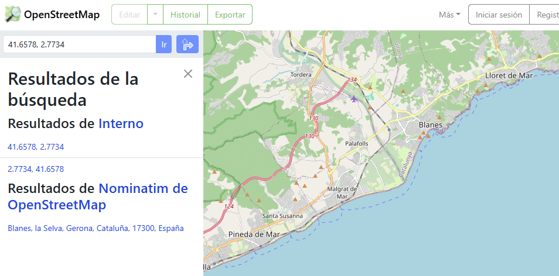
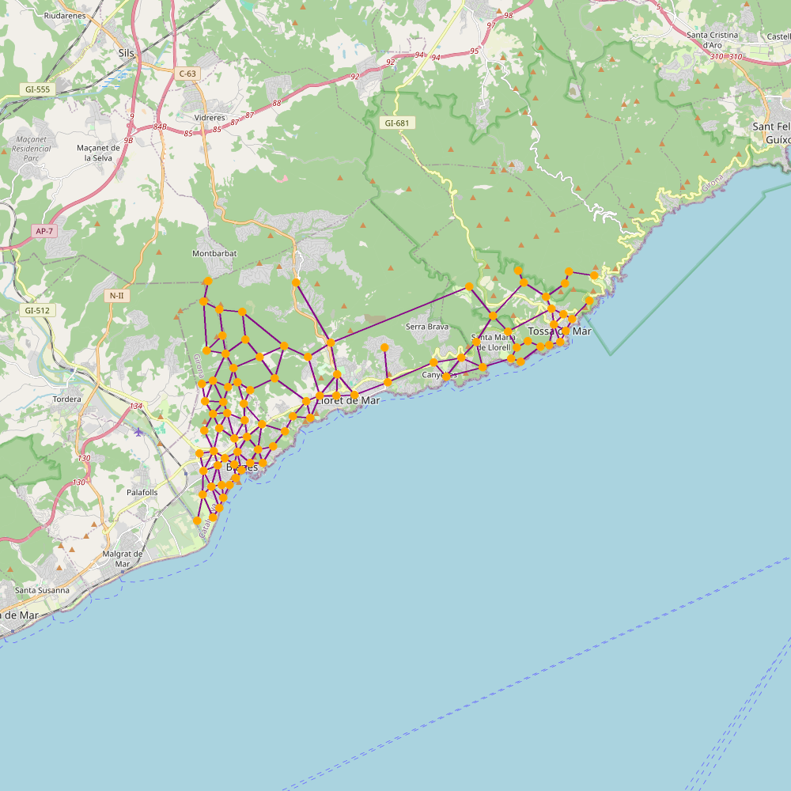

# Rutes i monuments

Gràcies per descarregar Rutes i Monuments. Aquest projecte és una implementació de la pràctica homònima d'AP2 del GCED. El programa us permet:

- Obtenir les rutes dels senderistes en una regió geogràfica.
- Inferir un mapa (un graf) a partir de les rutes.
- Obtenir les coordenades de monuments medievals.
- Trobar rutes òptimes per arribar a monuments medievals en el graf inferit.
- Visualitzar els mapes resultants en 2D i 3D. 

La informació d'aquest README s'ha distribuït segons el vostre interès pel projecte.
- Introducció i índex
- Manual d'usuari: funcionalitats del programa, com es fa servir...
- Informació per a *developers*: presa de decisions, testing...

## Manual d'usuari

Aquí tindreu accés a tota la informació sobre com fer servir l'aplicació: instal·lació, execució i funcionalitats.

Com a pas previ a qualsevol execució de codi des de la terminal, assegureu-vos que us trobeu al directori del projecte, on es troba aquest arxiu README.md, i feu servir la comanda `cd` per arribar-hi (podeu trobar més informació a [Wikipedia](https://en.wikipedia.org/wiki/Cd_(command))).

### Instal·lació

És necessari tenir instalades 8 llibreries. Podeu consultar-les a `requirements.txt`.

Per instal·lar-les, podeu fer servir la comanda `python -m pip install -r requirements.txt`, tenint connexió a internet.

### Execució

Com a requisit principal, es necessita connexió a internet per descarregar les dades i fer mapes (sense internet, no podem fer pràcticament res amb aquest programa).

L'execució del programa es pot fer de diverses formes, n'en destaquem 2. En les 2, tindrem accés a una sèrie de funcions que ens permetren tenir els segments, mapes i altres arxius que volem. Tot seguit entrarem en detall.

La forma més recomanable d'executar Rutes i Monuments és obrir un arxiu i escriure un seguit d'instruccions de Python. D'aquesta manera, poguem desar les instruccions per tornar-les a executar quan vulguem, si cal variant alguns paràmetres. Això serà molt útil per refer els mapes fins a aconseguir un que s'adapti a les nostres necessitats: podem variar la resolució, el color de les linies...

Per fer-ho, simplement haurem d'escriure a una de les primeres linies `from rutes_i_monuments import *`. Ara tindrem accés a totes les funcions d'aquest mòdul.

Si esteu acostumats a fer servir eines per a programadors, sabreu com veure el "docstring" de les funcions, que us donarà una pista sobre què fan i com s'utilitzen. Però si no és així, tot seguit teniu una descripció de tot el que podeu fer amb Rutes i Monuments, i ho tractarem de fer comprensible per usuaris que no tinguin experiència en programar.

Explicarem les funcions al llarg d'un exemple. Trobareu el codi complet al final de d'aquesta explicació.

Com a comentari previ: moltes funcions estan configurades per donar, per defecte, missatges a la consola explicant què està succeïnt. Podem desactivar això escrivint una linia de codi i posant `DEFAULT_FEEDBACK = False`, tot i que no es recomana.
[COMPROVAR QUE FUNCIONA I QUE NO SURTEN MISSATGES]

#### Funcions principals de rutes_i_monuments.py i exemple d'ús

##### Definició d'una àrea

Podem definir una àrea rectangular per tractar amb les que necessitem. Com ho fem? Primer haurem de tenir 2 punts sobre el globus terraqui. Per aconseguir-los, un possible mètode és anar a la web de [OpenStreetMap](https://www.openstreetmap.org/), posar el ratolí a un punt del mapa, fer clic dret, i clicar a "Mostrar direcció". A l'esquerra de la pantalla se'ns obrirà una petita finestra amb text, i una barra de cerca on hi hauran escrits dos nombres que són les coordenades d'aquest punt, en format latitud, longitud. Ens interessa agafar la cantonada esquerra inferior i la cantonada dreta superior. Amb aquest 2 punts definim una "Box" que serà la nostra zona de treball.

Per exemple, busquem una àrea al voltant de Blanes, Lloret de Mar i Tossa de Mar.

Cliquem més a la cantonada inferior esquerra del que serà el nostre rectangle: veiem que és el punt (41.6578, 2.7734).

Recíprocament amb la cantonada dreta superior: seleccionem el punt (41.7411, 2.9481).

Fet això, podem definir la nostra "Box".

`box_costa_selva = Box(Point(41.6578, 2.7734), Point(41.7411, 2.9481))`

És important mantenir la sintaxi, canviant només els nombres però mantenint la resta d'elements. Per qualsevol parella de punts (a1, a2), (b1, b2), escriurem:

`nom_de_la_caixa = Box(Point(a1, a2), Point(b1, b2))`

#### Mapejat de l'àrea

Abans de seguir, podem veure quina és l'àrea què hem definit i quina és la distància de la seva diagonal. Això és interessant de fer perquè descarregar les dades per mapejar les rutes trigarà bastant, i és convenient que ens assegurem que hem seleccionat l'àrea correcta.

És clar, si estem segurs que l'àrea és correcta, aquest pas ens el podem saltar.

A una linia, escrivim: `preview_box("preview-costa_selva.png", box_costa_selva)`

Fixeu-vos: "preview-costa_selva.png" és un nom arbitrari que hem decidit per el mapa que exportarem. Es generarà al directori actual. L'únic requisit pel nom de l'arxiu és que acabi en .png, perquè serà una imatge.

Després d'executar aquestes 2 linies de codi en ordre (definir la caixa i fer el preview), podrem veure aquest mapa:

 
Bé! Aquest rectangle ens servirà.

### Mapejat dels camins

Una opció que tenim amb el programa és veure una aproximació dels camins per on podem moure'ns.

Per això farem servir `quick_paths("costa_selva", box_costa_selva)`

El que fem amb aquesta linia és demanar que es generin 3 arxius: un .dat, un .png i un .kml.
- costa_selva.dat contindrà les dades que necessitem per mapejar la zona. Trigarà una estona en descarregar-se, però es guardarà i no haurem de tornar-ho a fer. A més, podem interrompre l'execució i seguir-la més tard, i no hauria de causar cap problema.
- costa_selva.png serà un mapa de les rutes per on ha passat algun usuari generant dades, i que potser serà transitable (hi ha casos on no, perquè les dades poden ser errònies o potser es tracta d'una autopista o carretera no transitable). Tindrà l'aspecte d'un graf.
- costa_selva.kml serà un arxiu que podrem pujar a Google Earth per visualitzar el mapa del .png en 3D, poder fer zoom i moure'ns lliurement.

ALERTA: si els arxius amb extensió .png i .kml ja existeixen, es sobreescriuran automàticament. El .dat estarà protegit per aquesta box i no s'esborrarà en cap cas, anoser que l'esborreu manualment (o el programa es comporti de forma inesperada).

Quan executem aquesta linia de codi, i si tot va bé, la terminal ens començarà a indicar que està descarregant dades. Haurem d'esperar una minuts, temps que depèn de les característiques del nostre ordinador i de la qualitat de la connexió a internet. Aquest procés es pot interrompre tancant el programa, i en tornar a executar la linia de codi, seguirà descarregant per on es va quedar.

En acabar, veurem 2 arxius nous.
- El mapa ja simplificat:

### [REFER LA FOTO AMB SIMPLIFY GRAPH]

- I el kml (que podem importar a Google Earth ... )
...

Aquestes imatges potser no ens agraden del tot, i volem canviar els colors de les linies o punts, la seva mida, o la resolució de la imatge. Per qualsevol d'aquestes coses haurem de fer servir la "versió extesa" de les funcions, que ens permetran posar els paràmetres que volguem. Més avall explicarem com es fa això, per tenir un millor control de l'execució.

Per últim, podem veure les rutes als mnuments disponibles:
quick_routes ...

I ara sí: el codi sencer:

`# tutorial1.py
\'\'\'python
""" 
Programa per mapejar una zona al voltant de 
les ciutats costeres de la comarca de la Selva.
"""

from rutes_i_monuments import *

box_costa_selva = Box(Point(41.6578, 2.7734), Point(41.7411, 2.9481))

preview_box("preview-costa_selva.png", box_costa_selva)

quick_paths("costa_selva", box_costa_selva)
(\'\'\)'

### [FER QUE ES VEGI COM CODI]

#### Funcions específiques i exemple d'ús

### [EXECUTAR TOT EN UNA I POSAR IMATGES]

Suposem que, rere veure el mapa general d'aquesta zona, volem un mapa més espefcífic al voltant de Tossa de Mar, perquè la volem visitar. Volem personalitzar el mapa i que, en trobar les rutes, no es torni a generar el graf dels camins, sinó treballar tot d'una amb el mateix. A més a més, volem canviar alguns paràmetres per aconseguir el mapa que ens agradi.

##### Definició d'una llista de Segments i mapejat

Començarem descarregant les dades i posant-les en una variable. Per això necessitem definir la nova Box.

`box_tossa = Box(Point(41.7128, 2.9159), Point(41.7300, 2.9416))`

Amb la qual podem cridar la funció get_segments(), que descarregarà les dades al document del primer paràmetre (que ha de tenir extensió .dat).

`segments_tossa = get_segments("tossa.dat", box_tossa)`

Ara, podem servir aquestes dades per fer un mapa amb la "densitat" de quant es transita cada camí:
`export_png_map("segments_tossa.png", segments_tossa)`

### [INSERTAR IMATGE]

La imatge generada és un mapa amb camins, alguns més gruixuts que altres, que indiquen per on han pasat dispositius que en generat dades gpx. Dit d'una altra manera, és un mapa que mostra les rutes i com "d'importants" són. Pot ser útil visualment, però per trobar els Monuments necessitarem simplificar-lo

##### Definició d'un objecte de la classe Graf

Amb els segments, definim un graf:

`graf_tossa = make_graph(segments_tossa)`

Amb aquest podem fer diverses coses, per exemple, mapejar-lo:

`export_png_map("graf_tossa.png", graf_tossa)`

### [POSAR IMATGE]

Aquest mapa és potser menys natural que l'altre, és a dir, els camins poden no semblar coherents. Hem perdut precisió, però ara podrem buscar els monuments.

##### Cerca de monuments

...

### [HACER EJEMPLO MODIFICANDO PARÁMETROS DE N_CLUSTERS Y CARACTERISTICAS DEL MAPA]

#### Execució "exprés"

Si no volem obrir un document, sinó que simplement volem definir ràpidament una àrea i visualitzar el mapa o les rutes, podem fer servir la consola d'una manera molt similar. Escrivint a la linia de comandes `python -i rutes_i_monuments.py`, iniciem l'intèrpret de Python amb totes les funcions incloses.

D'aquesta manera, podem escriure les comandes una a una sense obrir cap arxiu de Python. Aquest mètode no el recomanem tant com l'altre perquè no es té tanta assistència a l'hora de programar dirèctament al terminal. És més fàcil que ens equivoquem o que ens deixem coses pel camí. Encara així, per fer coses bàsiques, pot anar bé.

Si executem les linies del document anterior en ordre, hauríem de tenir la mateixa sortida.
### [COMPROVAR]

...
Els colors disponibles per fer exportar mapes en PNG són els del mòdul Pillow.
https://stackoverflow.com/questions/54165439/what-are-the-exact-color-names-available-in-pils-imagedraw
...

## Informació de desenvolupament

Com de costum, és recomanable tenir un bon nivell d'anglès per programar. A més, els docstrings i els identificadors també s'han escrit en anglès.

### Aspectes generals

...

`feedback: bool` és un paràmetre que trobem al llarg de tot el programa. Sempre fa el mateix, i sempre està per defecte establert a True. Escriu a la consola de comandes uns misatges que donen una idea a l'usuari sobre què està fent el programa. És recomanable deixar el feedback activat, però des de main.py podem establir DEFAULT_FEEDBACK a false i es desactivarà a tot arreu.

...

### Estructura del programa

El programa s'ha separat en diferents mòduls. Primerament explicarem com funcionen en conjunt i després donarem detalls sobre cadascún.

El programa consta de 8 mòduls: generics, segments, map_drawing, clustering, graphmaker, monuments, routes i rutes_i_monuments.

Generics conté una funció que utilitzen diversos mòduls. segments proporciona les funcions per descarregar i fer servir les dades de OpenStreetMap, map_drawing conté tot allò relacionat amb la creació d'imatges i fitxers kml, clustering s'encarrega del cluster amb K-Means, graphmaker permet generar grafs i simplificar-los, monuments permet descarregar i carregar els monumenents, routes permet simplificar els grafs per trobar rutes i, per últim, rutes_i_monuments ajunta totes les funcions públiques i defineix unes noves que serveixen per simplificar l'ús del programa.

...
cluster no és una funció pensada per ser usada per l'usuari, ja que, a la pràctica, fer el graf és més simple d'entendre, alhora que més útil, i en essència per l'usuari seran el mateix. Bàsicament, l'usuari ha de fer dirèctament el graf sense demanar res a clustering.
...

### Presa de decisions

#### Funció get_segments() i arxius .txt

Descàrregar els segments és bastant lent. Segons la mida de la Box, les característiques de l'ordinador on executem el programa i la qualitat de la coneexió a internet, pot arribar a trigar més de mitja hora. Convé destacar que el programa està pensar per calcular rutes per anar a peu per senderistes, que normalment no seran massa llargues. No està pensat per agafar àrees de vàries desenes de kilòmetres de diagonal. Per tant, malgrat que aquest temps no es dispararà encara tenint una connexió inestable, sí que és cert que descarregar les dades és un procés que s'ha de fer un sol cop.

### [DE VERITAT LA CONNEXIÓ AFECTA? TESTEJAR MATEIXA BOX AMB DIFERENT INTERNET I DIFERENT ORDINADOR (4 SITUACIONS)]

Per aquest motiu, els documents on es desen les dades, els .dat, estan protegits. El programa està pensat per que l'usuari pugui identificar a quina àrea pertanyen els documents, fent servir la funció read_header, o accedint al document que tindrà el mateix nom que el .dat, però acabarà en .txt (a aquest l'hem anomenat header).

Aquest arxiu a part té diverses utilitats que ajuden a l'usuari a no perdre el control de les dades. Desen 3 coses: les coordenades de la Box (en format longitud, latitud), un booleà que indica si s'han acabat de descarregar les dades de OpenStreetMap i un natural que indica la última pàgina descarregada.

Això, en conjunt, permet diverses comprovacions. D'una banda, si l'usuari fa un get_segments() (on un paràmetre sempre haurà de ser un arxiu .dat), el programa mai hauria de sobreescriure les dades si aquest arxiu ja existeix. Es poden donar diferents casuístiques segons els paràmetres que pasem:

- Donem un "filename" que no existeix i no donem "Box": salta error perquè no es pot saber què volem descarregar.
- Donem un "filename" que no existeix i sí donem una "Box": el programa genera un nou arxiu .dat, que a partir d'ara serà excliusiu per aquesta Box. Segueix el procés de descarregar i carregar les dades.
- Donem un "filaneme" que ja existeix, i una "Box" que no correspon: salta error perquè aquest "filename" no es correspon a la caixa i no permetem que l'usuari pugui sobreescriure sense voler les dades del .dat.
- Donem un "filename" que ja existeix i la seva "Box" corresponent (exactament la mateixa): el programa segueix amb la càrrega / descàrrega de les dades de l'arxiu.
- Donem un "filename" que ja existeix i no donem cap "Box": el programa segueix amb la càrrega / descàrrega de les dades.

D'aquesta manera, no permetem que un arxiu .dat contingui dades de caixes diferents o sigui esborrat pel programa. Si l'usuari vol canviar les dades d'un arxiu .dat, haurà d'esborrar-lo manualment (a través de la terminal o de l'explorador d'arxius).

A més a més: fixeu-vos que la descàrrega / càrrega de dades és automàtica. get_segments() sempre mirarà si el booleà del .txt està a True, i si no és així, cridarà a la funció per descarregar dades des de la següent pàgina a la última que van descàrregar (que també tenim al .txt).

Això ens permet parar la descarrega i seguir-la després, cosa que fa el programa resistent a situacions on es pugui perdre la connexió a internet. Però, per tal que això funcioni, és important que l'arxiu .dat es vagi escrivint a poc a poc. És per això que _download_segments() fa, pàgina a pàgina de les dades de OpenStreetMap, el següent procés: descarregar la pàgina, ordenar els segments segons temps, eliminar els que tenen "temps negatiu" (més avall s'entra en detalls), apuntar els segments al .dat i, per últim, actualitzar el .txt amb el nombre d'aquesta pàgina. És quan no queden elements per descarregar que hem arribat a la última pàgina i per tant, hem acabat i s'estableix el booleà del .txt a True.

Gràcies a la funció open() podem descarregar una pàgina de les dades, aturar el procés, i en tornar a cridar get_segment() seguirà on es va quedar.

És important destacar que això no succeeix amb els altres arxius: els mapes i els kmls es sobreescriuen quan demanem fer l'exportació. En conjunt, això permet executar el programa tants cops com volguem, sense haver de descarregar les dades cada cop, i sense generar imatges semblants entre sí.

#### Filtre de les dades

Les dades descarregades, en mapejar-les, donen resultats diversos: veiem linies rectes que travessen el rectangle de banda a banda, algunes que uneixen punts molt llunyans, etc. Això, es pot traslladar al graf, cosa que resulta en arestes que es creuen, sense haver-hi cap node, fet que no és coherent a un mapa. En la immensa majoria dels casos la solució és tan senzilla com limitar la longitud dels segments inicials, dels que descarreguem. Al nostre programa es comprova amb haversine() que la distància d'un segment és menor a 50 metres abans de carregar-lo. És un valor, generalment parlant, arbitrari, però és difícil acotar-lo perquè els segments tenen comportaments impredibles: a vegades són molt petits i es generen en dècimes de segon, i a vegades ocupen kilòmetres. Igualment, un segment amb una longitud de 50 metres normalment no causarà problemes, anoser que l'usuari vulgui mapejar una zona molt petita amb molta precisió.

### [TESTEAR]

Aquest filtre no suposa una diferència notable en el temps que triga el programa en carregar les dades i per això no s'ha mogut a la descàrrega. L'avantatge és que podem canviar la distància a comprovar sense haver de tornar a descàrregar res.

A part d'aquest filtre, a l'hora de descarregar s'eliminen els segments on el temps del punt final és anterior al temps del punt inicial (cosa que implica que hi ha algun error).

### Testing

S'han fet tota una sèrie d'arxius per comprovar les funcionalitats i posar a prova l'aplicació. Tal i com s'ha demanat, no s'han inclòs a la carpeta entregable.
...
[Escribir qué hacen los test cases actuales rápidamente y apuntar lo que falta por testear]

## Autors

Implementació del conjunt del programa:

- Ángel Morales
- Nuria Díaz

Context de la pràctica i algunes funcions bàsiques:

- Laia Mogas
- Jordi Cortadella
- Pau Fernández
- Jordi Petit

Universitat Politècnica de Catalunya, 2024

---

És difícil assegurar que els mapes quedaran coherents i no hi haurà camins "impossibles". Això és perquè, en el moment que simplifiquem, sempre modifiquem els camins, i no hi ha manera de saber per on pasaran: per sobre de rius, llacs, propietats privades...

Per suposat es necessita la discreció de l'usuari. No ha d'entrar a llocs que puguin ser privats o no ser segurs.
