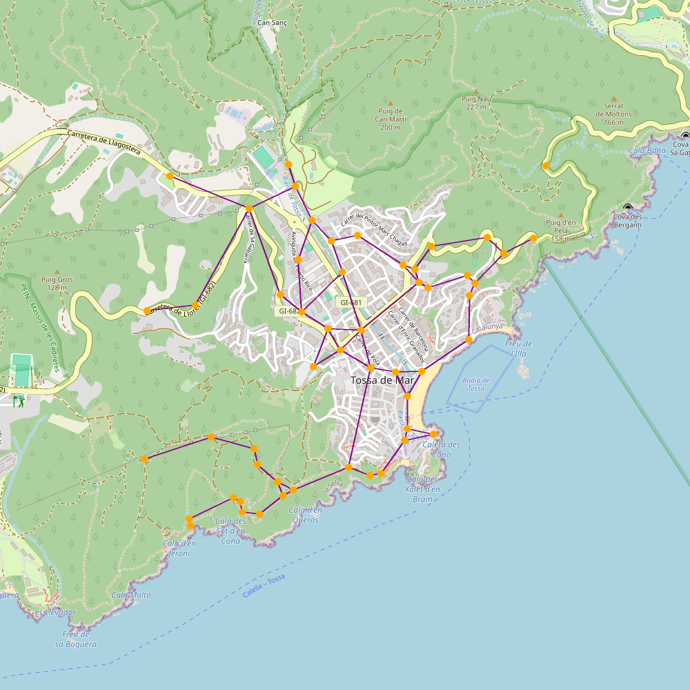
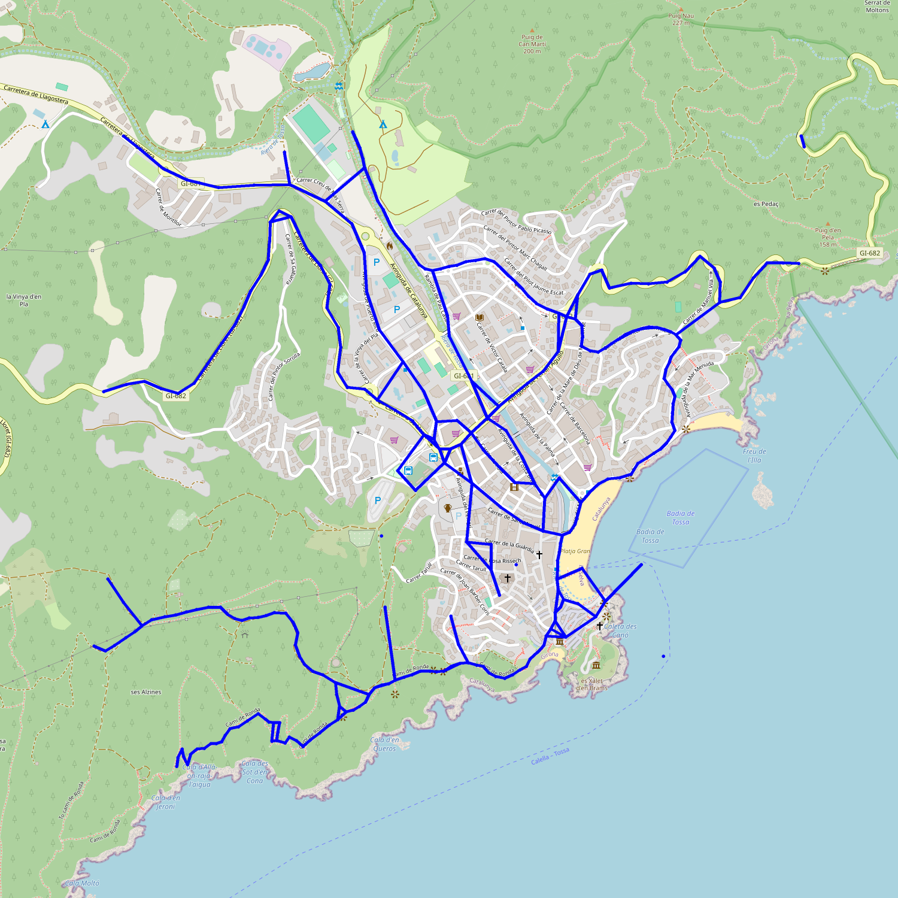

# Rutes i monuments

Gràcies per descarregar Rutes i Monuments. Aquest projecte és una implementació de la pràctica homònima d'AP2 del GCED. El programa us permet:

- Obtenir les rutes dels senderistes en una regió geogràfica
- Inferir un mapa (un graf) a partir de les rutes
- Obtenir les coordenades de monuments medievals
- Trobar rutes òptimes per arribar a monuments medievals en el graf inferit
- Visualitzar els mapes resultants en 2D i 3D

La informació d'aquest README s'ha distribuït segons el vostre interès pel projecte.

- Introducció i índex
- Manual d'usuari: funcionalitats del programa, com es fa servir... i exemple complet d'ús
- Informació per a _developers_: presa de decisions, testing...

# Manual d'usuari

Aquí tindreu accés a tota la informació sobre com fer servir l'aplicació: instal·lació, execució i funcionalitats.

Com a pas previ a qualsevol execució de codi des de la terminal, assegureu-vos que us trobeu al directori del projecte, on es troba aquest arxiu README.md i feu servir la comanda `cd` per arribar-hi (podeu trobar més informació a [Wikipedia](<https://en.wikipedia.org/wiki/Cd_(command)>)).

Com a comentari previ, es demana discreció a l'usuari. És difícil assegurar que els mapes quedaran coherents i no hi haurà camins "impossibles". Això és perquè, en el moment que simplifiquem, sempre modifiquem els camins, i no hi ha manera de saber per on pasaran: per sobre de rius, llacs, propietats privades...

L'usuari no ha posar-se en risc ni entrar a propietats privades digui el que digui aquest programa. Els mapes generats només serveixen per aproximar les rutes; també és probable que no siguin del tot precisos.

## Instal·lació

És necessari tenir instalades 8 llibreries. Podeu consultar-les a `requirements.txt`.

Per instal·lar-les podeu fer servir la comanda `python -m pip install -U -r requirements.txt`, tenint connexió a internet.

Tot i que no és un requeriment per començar a executar certes funcions, és convenient començar a descarregar els monuments tan aviat com sigui possible (en el cas que no es disposi inicialment d'ells). Es recomana executar `monuments.py` i deixar-la en segon pla descarregant els monuments.

## Execució

Com a requisit principal es necessita connexió a internet per descarregar les dades i fer mapes (és a dir, les funcions més importants).

L'execució del programa es pot fer de diverses formes, n'en destaquem dues. En ambdues es té accés a una sèrie de funcions que permeten descarregar, processar i visualitzar les dades. Tot seguit entrarem en detall.

La forma més recomanable d'executar Rutes i Monuments és obrir un arxiu i escriure un seguit d'instruccions de Python. D'aquesta manera es poden desar les instruccions per tornar-les a executar. si cal, variant alguns paràmetres. Això serà molt útil per refer els mapes fins a aconseguir un que s'adapti a les nostres necessitats: es pot variar la resolució, el color de les linies... Per fer-ho, simplement s'ha d'escriure a una de les primeres linies `from rutes_i_monuments import *`. Ara tindrem accés a totes les funcions d'aquest mòdul.

Si esteu acostumats a fer servir eines per a programadors, sabreu com veure el "docstring" de les funcions, que us donarà una pista sobre què fan i com s'utilitzen. Però si no és així, tot seguit es descriu tot el que es pot fer amb Rutes i Monuments, i s'ha tractat de fer comprensible per usuaris que no tinguin experiència programant.

Explicarem les funcions al llarg d'un exemple. Trobareu el codi complet al final de d'aquesta explicació.

Com a comentari previ: moltes funcions estan configurades per donar, per defecte, missatges a la consola explicant què està succeïnt. Podem desactivar això al mòdul generics.py posant `DEFAULT_FEEDBACK = False`, tot i que no es recomana.

### Funcions principals de rutes_i_monuments.py i exemple d'ús

#### Definició d'una àrea

Podem definir una àrea rectangular per tractar amb les dades que necessitem. Per fer-ho primer haurem de tenir 2 punts sobre el globus terraqui. Per aconseguir-los un possible mètode és: anar a la web de [OpenStreetMap](https://www.openstreetmap.org/), posar el ratolí a un punt del mapa, fer clic dret i clicar a "Mostrar direcció". A l'esquerra de la pantalla se'ns obrirà una petita finestra amb text i una barra de cerca on hi hauran escrits dos nombres que són les coordenades d'aquest punt, en format latitud, longitud. Ens interessa agafar la cantonada esquerra inferior i la cantonada dreta superior. Amb aquest 2 punts definim una "Box" que serà la nostra zona de treball.

Per exemple, busquem una àrea al voltant de Blanes, Lloret de Mar i Tossa de Mar.

Cliquem a la cantonada inferior esquerra del que serà el nostre rectangle: veiem que és el punt (41.6578, 2.7734).


Fem el mateix amb la cantonada dreta superior: cliquem i veiem que és el punt (41.7411, 2.9481).

Fet això, podem definir la nostra "Box".

`box_costa_selva = Box(Point(41.6578, 2.7734), Point(41.7411, 2.9481))`

Podeu donar-li a la caixa el nom que volgueu, en aquest cas hem fet servir "box_costa_selva".

#### Mapejat de l'àrea

Abans de seguir, podem veure quina és l'àrea què hem definit i quina és la distància de la seva diagonal. Això és interessant de fer perquè descarregar les dades per mapejar les rutes trigarà bastant, i és convenient que ens assegurem que hem seleccionat l'àrea correcta.

Si estem segurs que l'àrea és correcta, aquest pas ens el podem saltar.

A una linia, escrivim: `preview_box("tuto1-preview-costa_selva.png", box_costa_selva)`

Fixeu-vos: "preview-costa_selva.png" és un nom arbitrari que hem decidit pel mapa que exportarem. Es generarà al directori de treball des d'on executem l'arxiu de Python. L'únic requisit pel nom de l'arxiu és que acabi en ".png", perquè serà una imatge.

Després d'executar aquestes 2 linies de codi en ordre (definir la caixa i fer el preview), podrem veure aquest mapa:


Bé! Aquest rectangle ens servirà.

#### Mapejat dels camins

Una opció que dona el programa és veure una aproximació dels camins per on podem moure'ns, a la zona definida.

Per això farem servir `quick_paths("costa_selva", "mapa_costa_selva", box_costa_selva)`

El que fem amb aquesta linia és demanar que es generin 3 arxius: un .dat, un .png i un .kml.

- costa_selva.dat contindrà les dades que necessitem per mapejar la zona. Trigarà una estona en descarregar-se, però es guardarà i no haurem de tornar-ho a fer. A més, podem interrompre l'execució i seguir-la més tard i, en principi, no hauria d'haver cap problema.
- costa_selva.png serà un mapa de les rutes per on ha passat algun usuari generant dades, i que potser serà transitable (hi ha casos on no, perquè les dades poden ser errònies o potser es tracta d'una autopista o carretera no transitable). Tindrà l'aspecte d'un graf.
- costa_selva.kml serà un arxiu que podrem pujar a Google Earth per visualitzar el mapa del .png en 3D, poder fer zoom i moure'ns lliurement.

ALERTA: si els arxius amb extensió .png i .kml ja existeixen, es sobreescriuran automàticament. El .dat estarà protegit per aquesta box i no s'esborrarà en cap cas, anoser que l'esborreu manualment (o el programa es comporti de forma inesperada). Més avall a aquest README s'entra en detall sobre això.

En executar-se aquesta última linia de codi, i si tot va bé, la terminal ens començarà a indicar que està descarregant dades. Haurem d'esperar uns minuts, temps que depèn de les característiques del nostre ordinador, principalment, però que no variarà massa. Aquest procés es pot interrompre tancant el programa i, en tornar a executar la linia de codi, seguirà descarregant per on es va quedar. Per tant, no cal fer-ho tot d'una, podeu parar el programar i tornar-ho a executar sense problema.

En acabar, veurem 2 arxius nous.

- El mapa (definit a partir d'un graf i simplificat):
  

- I l'arxiu KML, que podem importar a Google Earth desplegant amb la fletxa el menú lateral (a l'esquerra de la pantalla), fent clic a "nou", "arxiu KML local", "importar" i seleccionant el nostre arxiu d'extensió .kml. Aquí teniu el resultat:
  

Fet això, es poden buscar les rutes a monuments. Es necessita un punt d'inici, que podem aconseguir igual que com s'aconsegueixen les cantonades de la caixa. Llavors, farem servir la comanda següent:

`quick_routes("costa_selva", "rutes_costa_selva", box_costa_selva, Point(41.70088, 2.83788))`

És important que el primer nom d'arxiu sigui igual que l'anterior, en el cas d'haver fet servir la comanda per fer el mapa. D'aquesta manera s'aprofiten les dades descarregades, del contrari les descarregaríem de nou. És recomanable que el segon nom d'arxiu sí que canvïi, per tal de no sobreescriure els mapes fets amb l'anterior comanda.

El resultat és similar, però ara el mapa és reduït, i veiem destacats els monuments a l'arxiu .png.




Amb aquesta comanda també es donen dos llistats a la terminal, dient quins monuments s'han detectat a aqusta zona i on s'ubiquen. S'ha posat una part dels missatges de la terminal (els tres punts indiquen que s'han omès algunes linies).

```
...
Loading monuments.
Done: monuments loaded.
There are 18 in this box.
These are the monuments and their locations (in latitude - longitude format):
Castell de Blanes (castell) at 41.679485, 2.798287
Castell de Sant Joan (castell) at 41.693878, 2.839405
Castell d’en Plaja (castell) at 41.699505, 2.859592
...
Santuari de la Mare de Déu de les Alegries (esglesia) at 41.717514, 2.829516
Creating the tree.
These are the nodes which contain the reachable monuments:
Node at 41.69847563210676, 2.839046449474323 contains monuments: ['Castell de Sant Joan', 'Capella dels Sants Metges']
Node at 41.68123278558211, 2.8002382386533027 contains monuments: ['Castell de Blanes', 'Torre de Santa Bàrbara']
Node at 41.70204500294539, 2.8524742565146246 contains monuments: ['Església de Sant Romà']
...
Node at 41.71602136079355, 2.831665129455279 contains monuments: ['Santuari de la Mare de Déu de les Alegries']
...
```

Aquestes imatges potser no ens agraden del tot i volem canviar els colors de les linies o punts, la seva mida, l'alçada de les linies al KML, la resolució de la imatge, o la precisió del mapa. Per qualsevol d'aquests canvis s'ha de fer servir la "versió extesa" de les funcions, que permeten treballar amb més precisió i els paràmetres desitjats. A continuació s'explica com es fa això, per tenir un millor control de l'execució.

Abans, teniu el codi sencer del programa fet fins ara.

```python
# tutorial1.py

"""
Programa per mapejar una zona al voltant de
les ciutats costeres de la comarca de la Selva.
"""

from rutes_i_monuments import *

# Definim la caixa
box_costa_selva = Box(Point(41.6578, 2.7734), Point(41.7411, 2.9481))

# Veiem l'àrea definida
preview_box("preview-costa_selva.png", box_costa_selva)

# Generem el mapa dels camins
quick_paths("costa_selva", "mapa_costa_selva", box_costa_selva)

# Generem les rutes als monuments des d'un punt d'inici
quick_routes("costa_selva", "rutes_costa_selva", box_costa_selva, Point(41.70088, 2.83788))
```

#### Funcions específiques i exemple d'ús

Suposem que, rere veure el mapa general d'aquesta zona, volem un mapa més específic al voltant de Tossa de Mar perquè la volem visitar. Volem personalitzar el mapa i que, en trobar les rutes, no es torni a generar el graf dels camins, sinó treballar tot d'una amb el mateix mapa. A més a més, volem canviar alguns paràmetres per aconseguir el mapa que ens agradi.

#### Definició d'una llista de Segments i mapejat

Començarem descarregant les dades i posant-les en una variable. Per això necessitem definir la nova Box (de pas, la podem visualitzar):

`box_tossa = Box(Point(41.7128, 2.9159), Point(41.7300, 2.9416))`

`preview_box("preview-tossa.png", box_tossa)`

# la liada 1:
[tuto2-preview-tossa.png](tuto2-segments-tossa.png "Preview: preview-tossa.png")

Amb la caixa es pot cridar la funció get_segments(), que descarregarà les dades al document del primer paràmetre (que ha de tenir extensió .dat).

`segments_tossa = get_segments("tossa.dat", box_tossa)`

Ara, es pot fer servir aquestes dades per fer un mapa amb la "densitat" de quant es transita cada camí:
`export_png_map("segments_tossa.png", segments_tossa)`
# la liada 2:
[tuto2-segments_tossa.png](tuto2-preview_tossa.png "Mapa a partir dels segments: segments_tossa.png")

La imatge generada és un mapa amb camins, alguns més gruixuts que altres, que indiquen per on han pasat dispositius que en generat dades GPX. Dit d'una altra manera, és un mapa que mostra les rutes i com "d'importants" són. Pot ser útil visualment però per trobar les rutes als monuments, necessitarem simplificar-lo.

#### Definició d'un objecte de la classe Graf

Amb els segments, definim un graf:

`graf_tossa = make_graph(segments_tossa)`

Amb aquest podem fer diverses coses, per exemple, mapejar-lo:

`export_png_map("graf_tossa.png", graf_tossa)`


Aquest mapa és potser menys natural que l'altre, és a dir, els camins poden no semblar coherents. Hem perdut precisió, però ara podrem buscar els monuments. Les comandes que podríem fer servir serien les següents:

Primer definim un graf on només quedin els camins d'un punt d'inici a cada momument:

`routes_tossa = find_routes(graf_tossa, box_tossa, (Point(41.7202, 2.9335)))`

I llavors el mapejem:

`export_png_map("rutes_tossa.png", routes_tossa)`

`export_kml("rutes_tossa.kml", routes_tossa)`

Però abans de buscar els monumens podem modificar el mapa per tal d'aconseguir un que ens agradi més.

#### Definició dels paràmetres

A l'hora de crear el graf, hi ha 3 paràmetres opcionals que podem donar. Més avall s'entra en detall.

Per exemple, podem buscar un mapa més precís que l'anterior, no simplificat i amb 300 clusters:

`graf_tossa = make_graph(segments_tossa, n_clusters=300, simplify=False)`

Prèviament a la creació de mapes personalitzats, es defineixen els paràmetres en 2 diccionaris:

```python
colors: dict[str, str] = {
    "line": "blue",
    "marker": "blue",
    "monument": "purple",
    "kml_lines": "ff006400" # darkgreen
}

sizes: dict[str, int] = {
    "map_width": 1500,
    "map_height": 1500,
    "line_width": 5,
    "marker": 5,
    "monument": 20,
    "kml_lines": 10,
    "kml_height": 5
}
```

Els diccionaris han de complir uns requisits importants: han de tenir aquestes claus (és a dir, no ens podem deixar cap paràmetre per definir, de tots els elements a l'esquerra dels dos punts ":") i els valors han de seguir l'esquema donat: allà on hi ha nombres enters, s'ha de posar nombres enters, i on hi ha text, text (a més a més, el color de les linies del KML s'ha de donar en aquest format, es pot trobar més informació a la documentació de [simplekml](https://simplekml.readthedocs.io/en/latest/constants.html#simplekml.ColorMode)).

Definits els paràmetres es poden fer servir per generar mapes personalitzats.

`export_png_map("graf_personalitzat_tossa.png", graf_tossa, colors, sizes)`



`export_png_map("rutes_personalitzat_tossa.png", routes_tossa, colors, sizes)`


`export_kml("rutes_personalitzat_tossa.kml", routes_tossa, colors, sizes)`


Es poden observar les diferències respecte el mapa anterior de Tossa, fet sense personalitzar. Una curiositat interessant és que executar així el programa, a partir de la generació d'un graf inicial en compte d'usar les funcions quick
\_paths i quick_routes, ens permet generar rutes que estan al mapa inicial. Es pot apreciar com el mapa de rutes és una part agafada del mapa anterior. Usant les funcions ràpides, generem un graf nou cada cop que serà diferent, ja que l'agrupament de punts presenta aleatorietat (a la pràctica, a nivell d'algorisme ho desconeixem).

A continuació, els dos codis complets d'aquest exemple:

```python
# tutorial2.py

"""
Programa per mapejar una zona al voltant de Tossa de Mar,
fent cada pas per separat.
"""

from rutes_i_monuments import *

# Definim la caixa
box_tossa = Box(Point(41.7128, 2.9159), Point(41.7300, 2.9416))

# Veiem l'àrea definida
preview_box("preview-tossa.png", box_tossa)

# Definim els segments
segments_tossa = get_segments("tossa.dat", box_tossa)

# Veiem els camins en brut
export_png_map("segments_tossa.png", segments_tossa)

# Definim el graf
graf_tossa = make_graph(segments_tossa)

# Veiem el mapa del graf
export_png_map("graf_tossa.png", graf_tossa)

# Reduïm el mapa a les rutes a monuments, des d'un punt donat a prop de la platja de Tossa
routes_tossa = find_routes(graf_tossa, box_tossa, (Point(41.7202, 2.9335)))

# Visualitzem les rutes
export_png_map("rutes_tossa.png", routes_tossa)

# Generem l'arxiu kml de les rutes per portar a Google Earth
export_kml("rutes_tossa.kml", routes_tossa)
```

```python
# tutorial3.py

"""
Programa per mapejar una zona al voltant de Tossa de Mar,
personalitzant alguns aspectes dels mapes.
"""

from rutes_i_monuments import *

# Definim la caixa i els segments
box_tossa = Box(Point(41.7128, 2.9159), Point(41.7300, 2.9416))
segments_tossa = get_segments("tossa.dat", box_tossa)

# Definim un graf personalitzat
graf_tossa = make_graph(segments_tossa, n_clusters=300, simplify=False)

# Definim paràmetres personalitzats
colors: dict[str, str] = {
    "line": "blue",
    "marker": "blue",
    "monument": "purple",
    "kml_lines": "ff006400" # darkgreen
}

sizes: dict[str, int] = {
    "map_width": 1500,
    "map_height": 1500,
    "line_width": 5,
    "marker": 5,
    "monument": 20,
    "kml_lines": 10,
    "kml_height": 5
}

# Veiem el mapa del graf
export_png_map("graf_personalitzat_tossa.png", graf_tossa, colors, sizes)

# Reduïm el mapa a les rutes a monuments, des d'un punt donat a prop de la platja de Tossa
routes_tossa = find_routes(graf_tossa, box_tossa, (Point(41.7202, 2.9335)))

# Visualitzem les rutes
export_png_map("rutes_personalitzat_tossa.png", routes_tossa, colors, sizes)

# Generem l'arxiu KML de les rutes per portar a Google Earth
export_kml("rutes_personalitzat_tossa.kml", routes_tossa, colors, sizes)
```

### Execució "exprés"

Si no volem obrir un document, sinó que simplement volem definir ràpidament una àrea i visualitzar el mapa o les rutes, podem fer servir la consola d'una manera molt similar. Escrivint a la linia de comandes `python -i rutes_i_monuments.py`, iniciem l'intèrpret de Python amb totes les funcions incloses.

D'aquesta manera, podem escriure les comandes una a una sense obrir cap arxiu de Python. Aquest mètode no el recomanem tant com l'altre perquè no es té tanta assistència a l'hora de programar dirèctament al terminal. És més fàcil que ens equivoquem o que ens deixem coses pel camí. Encara així, per fer coses bàsiques, pot anar bé.

Si executem les linies del document anterior en ordre, hauríem de tenir la mateixa sortida.

### Resum de les funcions accessibles i el seu funcionament

#### Funcions bàsiques

Aquests funcions permeten escriure un seguit d'instruccions per descarregar i mapejar les dades. En aquestes, tots els paràmetres que siguin arxius han d'incloure l'extensió corresponent.

```Python
def get_segments(filename: str, box: Optional[Box] = None, endpage: int = -1, feedback: bool = DEFAULT_FEEDBACK)
```

Funció per agafar les dades dels segments. filename ha d'incloure l'extensió .dat. Convé establir un valor per endpage només si es pretén fer una prova de les dades i es vol estalviar temps; per tenir precisió és convenient descarregar-les totes. Endpage fa referència a com s'ordenen les dades a la web font.

get_segments protegeix els fitxers .dat de ser sobreescrits. Si estan accessibles, comprovarà que, en cas d'haver donat una caixa com a paràmetre, sigui la caixa que correspon a aquestes dades. En cas contrari, saltarà un error. Si no donem cap caixa, ens retornarà les dades dirèctament. Sempre comprovarà que s'hagin descarregat les dades demanades i descarregarà les que faltin.

L'usuari pot saber a quina box pertany un arxiu .dat. S'ha d'accedir a l'arxiu .json amb el mateix nom i llegir el paràmetre "box_str". Aquest conté els dos punts en format longitud - latitud (la coma al mig separa els dos punts, les altres dos comes separen longitud de latitud a cada punt).

```Python
def export_png_map(
        filename: str,
        data: Graph | Segments | tuple[Segments, list[Point]],
        colors: dict[str, str] = DEFAULT_COLORS,
        sizes: dict[str, int] = DEFAULT_SIZES,
        feedback: bool = DEFAULT_FEEDBACK
    ) -> None:

def export_kml(
        filename: str,
        G: Graph,
        colors: dict[str, str] = DEFAULT_COLORS,
        sizes: dict[str, int] = DEFAULT_SIZES,
        feedback: bool = DEFAULT_FEEDBACK
    ) -> None:
```

Funcions per exportar mapes en format png i KML. La primera accepta grafs, segments o una tupla de segments i punts; mentre que la segona només grafs. El paràmetre filename ha d'incloure l'extensió corresponent (.png o .kml). Els dos diccionaris han de contenir totes les següents claus:

```python
colors: dict[str, str] = {
    "line": "purple",
    "marker": "orange",
    "monument": "red",
    "kml_lines": "ff0000ff" # red
}
"""Dictionary to set colors for map and KML creation."""

sizes: dict[str, int] = {
    "map_width": 1000,
    "map_height": 1000,
    "line_width": 2,
    "marker": 10,
    "monument": 15,
    "kml_lines": 5,
    "kml_height": 15
}
```

Aquests són els valors per defecte. Convé no allunyar-s'hi massa, ja que si apliquem una raó de multiplicar per 10 qualsevol valor podem començar a notar problemes. Igualment, si perdem la proporció entre els valors, també pot causar problemes. En qualsevol cas, l'usuari pot experimentar amb modificar els valors i si el programa sembla congelar-se o salten errors estranys, pot deixar les variables com estaven.

Els colors disponibles per fer exportar mapes en PNG són els del mòdul [Pillow](https://stackoverflow.com/questions/54165439/what-are-the-exact-color-names-available-in-pils-imagedraw).

Per KML s'ha de col·locar el valor hexadecimal, però no és el format estàndard. Es pot trobar una guia sobre com posar cada color a la documentació de [simplekml](https://simplekml.readthedocs.io/en/latest/constants.html#simplekml.ColorMode).

```python
def make_graph(segments: Segments, n_clusters: int = DEFAULT_N_CLUSTERS, simplify: bool = True, epsilon: float = DEFAULT_EPSILON) -> Graph:
```

Funció per generar un graf a partir d'uns segments. Té tres paràmetres opcionals. Un és el nombre de clusters, "n_clusters" (agupacions) que es faran, per defecte són 100. Reduir el nombre farà el mapa més simple, augmentar-lo el farà més precís, però amb el risc que alguns camins no es mostrin a causa de tenir unes dades inicials poc precises (és millor no elevar masa aquest nombre per no desconnectar el mapa). Succeeix l'invers amb el paràmetre "epsilon", l'angle per simplificar, que és l'angle mínim que es permetrà entre les 2 úniques arestes de qualsevol node amb dos veïns (serveix per eliminar nodes que no siguin necessaris per connectar camins). De fet, podem no simplificar el graf, establint el paràmetre "simplify" com False. Aquest paràmetre no causarà cap problema de desconnectar el mapa.

```python
def find_routes(G: Graph, box: Box, start: Point, feedback: bool = DEFAULT_FEEDBACK) -> Graph:
```

Funció per reduir un graf a un arbre, on l'arrel és el punt "start" i les fulles seran els nodes als monuments. Tant "start" com cada monument s'aproxima al node més proper. Necessita l'entrada de la caixa on volem buscar els monuments. És important que aquesta caixa sigui similar a la que s'ha fet servir per descarregar els segments i fer el graf, del contrari, podem perdre monuments o trobar monuments que no estan a la caixa.

#### Funcions extres

Aquestes funcions permeten fer certes coses més de pressa, però són més limitades en quant a paràmetres. En aquestes, cap paràmetre que sigui un nom per un arxiu ha de portar extensió.

```python
def quick_graph(data_filename: str, box: Box, n_clusters: int = DEFAULT_N_CLUSTERS, feedback: bool = DEFAULT_FEEDBACK) -> Graph:
```

Genera un graf a partir d'uns segments, cridant get_segments() i make_graph amb els paràmetres donats. S'han reduït els paràmetres de l'entrada. data_filename no ha d'incloure extensió.

```python
def quick_paths(data_filename: str, map_filename: str, box: Box, n_clusters: int = DEFAULT_N_CLUSTERS, feedback: bool = DEFAULT_FEEDBACK) -> None:

def quick_routes(data_filename: str, map_filename: str, box: Box, start: Point, n_clusters: int = DEFAULT_N_CLUSTERS, feedback: bool = DEFAULT_FEEDBACK) -> None:
```

Generen un png i un KML del graf complet i de l'arbre de les rutes respectivament. Necessiten el nom del fitxer de les dades, seguit del nom del fitxer per fer ambdós mapes (cap ha de portar extensió). També necessiten la caixa a mapejar i, en el cas de les rutes, un punt d'inici.

# Informació de desenvolupament

Com de costum, és recomanable tenir un bon nivell d'anglès per programar. A més, els docstrings i els identificadors també s'han escrit en anglès.

### Aspectes generals

`feedback: bool` és un paràmetre que trobem al llarg de tot el programa. Sempre fa el mateix, i sempre està per defecte establert a True en el mòdul `generics.py`. Escriu a la consola de comandes uns misatges que donen una idea a l'usuari sobre què està fent el programa. És recomanable deixar el feedback activat, però podem establir `DEFAULT_FEEDBACK` a false i es desactivarà a tot arreu.

### Estructura del programa

El programa consta de 8 mòduls: generics, segments, map_drawing, clustering, graphmaker, monuments, routes i rutes_i_monuments. Tot seguit es resumeix què fa cadascún.

#### generics.py

Conté les definicions de Point, Segment, Segments i Box, estableix el valor de DEFAULT_FEEDBACK i dues funcions genèriques, per donar un error si una extensió d'un arxiu és incorrecta i per retornar la distància entre dos objectes de la classe Point.

Box conté una funció que retorna els punts que la defineixen com un string. Aquest string té invertit el format (és longitud - latitud) i serveix per la web des d'on es descarreguen els segments. Aquest mateix string es desa al .json de cada arxiu de segments per identificar-lo. A l'apartat de presa de decisions s'entra en detall respecte això.

També conté el nom de l'arxiu on es desaran les dades dels monuments.

#### segments.py

Conté les funcions necessàries per descarregar i carregar segments. Els segments es desen a arxius .dat, i cadascún és una linia. Es generen segments de dos punts a partir dels segments descarregats de la web, de múltiples punts, després de filtrar les dades. A l'apartat de presa de decisions s'entra en detall respecte això. La funció get_segments() és la única que necessita l'usuari, ja que s'encarrega de decidir què s'ha de fer i donar un error si és necessari. Protegeix l'arxiu establert a generics.py per desar els monuments.

#### map_drawing.py

Conté les funcions que exporten arxius png i KML de les dades. L'usuari té accés a export_kml() i export_png_map(). Aquesta segona crida una altra funció segons les dades que ha donat l'usuari: graf, segments o tupla de segments i punts. Està pensada per permetre generar mapes diversos i no estar limitada només a grafs, ja que no hi ha problema amb treballar amb segments. L'entrada de punts permet pasar els centroides i comprovar com el graf és igual que el mapa generat a partir de centroides i els segments que els uneixen. Això, en principi, no ho hauria de demanar l'usuari.

#### clustering.py

Llibreria enfocada a graphmaker, conté les funcions que permeten fer l'agrupament de punts. La funció cluster no està pensada per ser usada per l'usuari ja que, a la pràctica, fer el graf és més simple d'entendre, alhora que més útil, i en essència per l'usuari, seran el mateix. Bàsicament, l'usuari ha de fer dirèctament el graf sense demanar res a clustering.

#### graphmaker.py

Conté les funcions que permeten fer el graf inicial a partir dels segments i les constants que s'han col·locat, per defecte, pel nombre de clusters i per l'angle mínim entre les aretes d'un node amb 2 veïns. La funció make_graph() s'encarrega de cridar les altres, segons toqui, per fer-ho tot.

#### monuments.py

S'encarrega de la descàrrega i càrrega dels monuments. La funció get_monuments() crida a les altres i dona errors, segons toca. També es defineixen els tipus de monuments i els enllaços que s'accediran de Catalunya Medieval. Funciona d'una forma similar a segments.py, també desa les dades a un arxiu .dat. Una diferència és que la funció no està pensada per usada, ja que no és paràmetre de cap altra funció. El que sí que pot fer l'usuari és executar monuments.py per descarregar les dades dels monuments, procés que és bastant lent.

#### routes.py

Conté les funcions que permeten crear l'arbre de les rutes a partir d'un graf i una caixa. La funció find_routes() crida a les altres segons toca. Es filtren els monuments de l'arxiu usant get_monuements(), s'aproximen als nodes del graf, s'aproxima el punt inicial i s'afegeixen valors als nodes amb monuments per poder-los distingir.

#### rutes_i_monuments.py

Ajunta totes les funcions pensades per a l'usuari i n'afegeix algunes més, de simples.

## Presa de decisions

### Descàrrega de dades

Descarregar els segments i els monuments pot ser bastant lent. Segons la mida de la Box, les característiques de l'ordinador on executem el programa i la qualitat de la connexió a internet, pot prendre bastants minuts. Encara que el programa estigui pensat per calcular rutes per anar a peu per senderistes, que normalment no seran massa llargues, s'ha de tractar que descarregar les dades es faci un sol cop.

Per aquest motiu, els documents on es desen les dades, els .dat, estan protegits, com s'ha explicat anteriorment. S'ha fet que cada arxiu .dat estigui acompanyat d'un arxiu .json amb metadades.

Aquest arxiu a part té diverses utilitats que ajuden a l'usuari a no perdre el control de les dades.

En el cas dels segments, desen 3 variables: les coordenades de la Box (en format longitud, latitud), un booleà que indica si s'han acabat de descarregar les dades de OpenStreetMap i un natural que indica la última pàgina descarregada.

En el cas dels monuments, desen el mateix booleà i tres nombres que són els índexos de l'últim monument descarregat.

Aquestes metadades permeten diverses comprovacions. D'una banda, si l'usuari fa un get_segments() (on un paràmetre sempre haurà de ser un arxiu .dat), el programa mai hauria de sobreescriure les dades si aquest arxiu ja existeix. Es poden donar diferents casuístiques segons els paràmetres que passem:

- Donem un "filename" que no existeix i no donem "Box": salta error perquè no es pot saber què volem descarregar.
- Donem un "filename" que no existeix i sí donem una "Box": el programa genera un nou arxiu .dat, que a partir d'ara serà excliusiu per aquesta Box. Segueix el procés de descarregar i carregar les dades.
- Donem un "filaneme" que ja existeix, i una "Box" que no correspon: salta error perquè aquest "filename" no es correspon a la caixa i no permetem que l'usuari pugui sobreescriure sense voler les dades del .dat.
- Donem un "filename" que ja existeix i la seva "Box" corresponent (exactament la mateixa): el programa segueix amb la càrrega / descàrrega de les dades de l'arxiu.
- Donem un "filename" que ja existeix i no donem cap "Box": el programa segueix amb la càrrega / descàrrega de les dades.

D'aquesta manera, no permetem que un arxiu .dat contingui dades de caixes diferents o sigui esborrat pel programa. Si l'usuari vol canviar les dades d'un arxiu .dat, haurà d'esborrar-lo manualment (a través de la terminal o de l'explorador d'arxius).

Tant pels segments com pels monuments la descàrrega / càrrega de dades és automàtica. Sempre es mirarà si el booleà del .json està a True, i si no és així, es cridarà a la funció corresponent, pasant l'índex del primer element que cal descarregar.

Això permet parar la descarrega i seguir-la després, cosa que fa el programa resistent a situacions on es pugui perdre la connexió a internet. Però, per tal que això funcioni, és important que l'arxiu .dat es vagi escrivint a poc a poc. És per això que els segments es descarreguen pàgina a pàgina i els monuments un per un.

Pels segments es fa el següent procés: descarregar la pàgina, ordenar els segments segons temps, eliminar els que tenen "temps negatiu" (més avall s'entra en detalls), apuntar els segments al .dat i, per últim, actualitzar el .json amb el nombre d'aquesta pàgina. És quan no queden elements per descarregar que hem arribat a la última pàgina i per tant, hem acabat i s'estableix el booleà del .json a True.

Pels monuments es descarrega la pàgina de cadascún i es busquen les seves coordenades. Certament, descarregar els monuments així és molt lent, perquè s'ha d'accedir a al voltant de tres mil urls, probablement hi ha mètodes més eficients.

És important destacar que aquesta protecció no es dona amb els altres arxius: els mapes .png i els .kml es sobreescriuen quan demanem fer l'exportació. En conjunt, això permet executar el programa tants cops com volguem, sense haver de descarregar les dades cada cop, i sense generar imatges semblants entre sí.

### Filtre de les dades

Les dades descarregades, en mapejar-les, donen resultats diversos: veiem linies rectes que travessen el rectangle de banda a banda, algunes que uneixen punts molt llunyans, etc. Això, es pot traslladar al graf, cosa que resulta en arestes que es creuen, sense haver-hi cap node, fet que no és coherent a un mapa. En la immensa majoria dels casos la solució és tan senzilla com limitar la longitud dels segments inicials, dels que descarreguem. Al nostre programa es comprova amb haversine() que la distància d'un segment és menor a 50 metres (valor assignat a una constant a segments.py) abans de carregar-lo. És un valor, generalment parlant, arbitrari, però és difícil acotar-lo perquè els segments tenen comportaments impredibles: a vegades són molt petits i es generen en dècimes de segon, i a vegades ocupen kilòmetres. Igualment, perdre un segment amb una longitud de 50 metres normalment no causarà problemes perquè per allà on passi segurament passaren altres segments.

Aquest filtre no suposa una diferència notable en el temps que triga el programa en carregar les dades, perquè el seu cost és lineal, i per això no s'ha mogut a la descàrrega. L'avantatge és que podem canviar la distància màxima sense haver de tornar a descàrregar res.

A part d'aquest filtre, a l'hora de descarregar s'eliminen els segments on el temps del punt final és anterior al temps del punt inicial (cosa que implica que hi ha algun error).

## Testing

S'han fet tota una sèrie d'arxius per comprovar les funcionalitats i posar a prova l'aplicació. A continuació s'han seleccionat alguns dels més importants i s'ha donat el seu output esperat. És una selecció reduïda, però la majoria de tests comporoven funcionalitats que van incloses aquí i alguns han quedat obsolets pels canvis fets.

### Tests de funcionalitats

```python
# test-example-segments.py

from segments import *
from map_drawing import *

# Define a box around Delta de l'Ebre
P1 = Point(40.5363713, 0.5739316671)
P2 =Point(40.79886535, 0.9021482)
BOX_EBRE_FLOATS = Box(P1, P2)

# Download the segments
segments = get_segments("test_datafile_delta_1.dat", BOX_EBRE_FLOATS)

# Export a map from the segments
export_png_map("map_delta_segments.png", segments)
```

Output esperat de l'execució el 1r cop, interrompuda: [REPETIR]

```
File test_datafile_delta_1.dat not found. Downloading the new box's data.
Page 0 has been sorted and added.
Page 1 has been sorted and added.
Page 2 has been sorted and added.
Page 3 has been sorted and added.
Page 4 has been sorted and added.
Page 5 has been sorted and added.
Traceback (most recent call last):
... (Descripció de l'excepció, cauada per fer CTRL C)
KeyboardInterrupt
```

Output esperat d'una nova execució:

```
File test_datafile_delta_1.dat found.
Looking for box with string 0.5739316671,40.5363713,0.9021482,40.79886535
File data corresponds to this box.
There is some data missing. Downloading the missing data.
Page 6 has been sorted and added.
Page 7 has been sorted and added.
...
Page 115 has been sorted and added.
Page 116 has been sorted and added.
test_datafile_delta_1.dat has been saved with the downloaded data.
Loading segments from file test_datafile_delta_1.dat.
Done: segments loaded.
Creating map.
Rendering map.
Map has been succesfully saved as map_delta_segments.png.
```


Output esperat d'una altra execució havent acabat l'anterior:

```
File test_datafile_delta_1.dat found.
Looking for box with string 0.5739316671,40.5363713,0.9021482,40.79886535
File data corresponds to this box.
All data was already gathered.
Loading segments from file test_datafile_delta_1.dat.
Done: segments loaded.
Creating map.
Rendering map.
Map has been succesfully saved as map_delta_segments.png.
```
S'ha regenerat la imatge, que s'ha de veure pràcticament igual a cada execució.

```python
# test-example-clustering.py

from segments import *
from map_drawing import *
from clustering import *

# Define a box around Delta de l'Ebre and get the segments
P1 = Point(40.5363713, 0.5739316671)
P2 =Point(40.79886535, 0.9021482)
BOX_EBRE_FLOATS = Box(P1, P2)
segments = get_segments("test_datafile_delta_1.dat", BOX_EBRE_FLOATS)

# Execute a clustering
centroid_labels, centroid_coords, edges, new_segments = cluster(segments, 100)

print(centroid_labels)          # an array of numbers (between 0 and 99)
print(centroid_coords)          # list of (100) points
print(max(centroid_labels))     # 99
print(min(centroid_labels))     # 0
print(len(centroid_coords))     # 100

# Export a map from the clustering
export_png_map("map_delta_clustered.png", (new_segments, centroid_coords))
```

Output esperat:
```
File test_datafile_delta_1.dat found.
Looking for box with string 0.5739316671,40.5363713,0.9021482,40.79886535
File data corresponds to this box.
All data was already gathered.
Loading segments from file test_datafile_delta_1.dat.
Done: segments loaded.
[11 11 11 ... 21 21 21]
[Point(lat=40.72379670573755, lon=0.5912383421399496), Point(lat=40.707727496314156, lon=0.7384342619703756),  ..., Point(lat=40.62138539328047, lon=0.5966158684891485), Point(lat=40.72142145744048, lon=0.7392537183333333)]
99
0
100
Creating map.
Rendering map.
Map has been succesfully saved as map_delta_clustered.png.
```

A la llista de punts n'hem omès la majoria i hem posat tres punts "...".

Si tornem a executar el programa hauríem de veure un mapa similar, però amb diferències clarament perceptibles, degut al factor aleatori (o almenys per nosaltres desconegut) del l'agrupament. L'array d'enters i la llista de punts també seran diferents a cada execució.

```python
# test-example-graphmaking.py

from segments import *
from map_drawing import *
from graphmaker import *

# Define a box around Delta de l'Ebre and get the segments
P1 = Point(40.5363713, 0.5739316671)
P2 =Point(40.79886535, 0.9021482)
BOX_EBRE_FLOATS = Box(P1, P2)
segments = get_segments("test_datafile_delta_1.dat", BOX_EBRE_FLOATS)

# Create a graph from the segments
G = make_graph(segments)

print(G)                # Graph with 100 nodes and 220 edges
print(G.edges)          # list[tuple[int, int]]
print(G.nodes.data())   # list[tuple[int, dict['Point': Point]]]
print(G.edges.data())   # list[tuple[int, int, dict['distance': float]]]

# Export a map from the graph
export_png_map("map_delta_graf.png", G)

# Export a KML from the graph
export_kml("map_delta_graf.kml", G)
```

Output esperat:
```
File test_datafile_delta_1.dat found.
Looking for box with string 0.5739316671,40.5363713,0.9021482,40.79886535
File data corresponds to this box.
All data was already gathered.
Loading segments from file test_datafile_delta_1.dat.
Done: segments loaded.
Graph with 88 nodes and 153 edges
[(91, 39), (91, 22), ..., (88, 71)]
[(91, {'point': Point(lat=40.71182561984545, lon=0.5794728957012021)}), (39, {'point': Point(lat=40.71848962580888, lon=0.585530803407503)}), ..., (14, {'point': Point(lat=40.67638317555556, lon=0.7243351533333333)})]    
[(91, 39, {'distance': 0.8998721880410913}), (91, 22, {'distance': 0.9878205568921883}), (91, 63, {'distance': 0.885652689729628}),  ..., (88, 71, {'distance': 2.196071625218686})]
Creating map.
Rendering map.
Map has been succesfully saved as map_delta_graf.png.
Creating kml.
KML file has been successfully saved as map_delta_graf.kml.
```


S'ha posat tres punts "..." per ometre elements a la llista d'arestes, a la llista de nodes amb els seus punts i a la llista d'arestes amb les seves distàncies. Els elements del les llistes seran diferents a cada execució. De nou, en tornar a executar, el mapa ha de ser similar.

```python
# test-example-routes.py

from segments import *
from map_drawing import *
from graphmaker import *
from monuments import Monument
from routes import _create_tree

# Define a box around Delta de l'Ebre and get the segments
P1 = Point(40.5363713, 0.5739316671)
P2 =Point(40.79886535, 0.9021482)
BOX_EBRE_FLOATS = Box(P1, P2)
segments = get_segments("test_datafile_delta_1.dat", BOX_EBRE_FLOATS)

# Create a graph from the segments
G = make_graph(segments)

# Define some monuments
testing_monuments = [   
        Monument("Deltebre", "test", Point(40.72082, 0.71721)),
        Monument("Mirador del Zigurat", "test", Point(40.72304, 0.85995)),
        Monument("Amposta", "test", Point(40.70718, 0.57895))
    ]

# Generate the route tree
start = Point(40.75718, 0.70385)
T = _create_tree(G, start, testing_monuments)

# Export a map from the tree
export_png_map("map_delta_routes.png", T)
```

Output esperat:

```
File test_datafile_delta_1.dat found.
Looking for box with string 0.5739316671,40.5363713,0.9021482,40.79886535
File data corresponds to this box.
All data was already gathered.
Loading segments from file test_datafile_delta_1.dat.
Done: segments loaded.
Creating map.
Rendering map.
Map has been succesfully saved as map_delta_routes.png.
```


En tornar a executar, hauríem de veure una imatge similar.

### Tests d'errors
#### La connexió a internet
Sense connexió a internet, com que el programa necessita accedir a pàgines web, surten errors de connexió i no és possible ni tan sols fer un mapa. Només pots definir un Box si ja coneixes les coordenades. Si l'usuari tracta d'executar el codi sense connexió sortirà el següent missatge al terminal:
```
ConnectionError: Connection error. Check internet connection and try again. If error persists, the server where the data is gathered from may be offline, try waiting a few hours.
```

#### Una Box no corresponent
En el cas que l'usuari donés una Box no corresponent al arxiu de les dades, el programa s'aturarà per a evitar un possible error en els paràmetres de sortida. Si el FEEDBACK_DEFAULT està activat, a la terminal sortirà un missatge explicant l'error i com solucionar-lo:
```
SyntaxError: File test_datafile5.dat does not correspond to the box -118.243683,34.052235,-118.243683,34.052235, it corresponds to box 2.7734,41.6578,2.9481,41.7411.
The execution has been stoped to avoid a possible mistake in the parameters input.
In order to rewrtie test_datafile5.dat with new data from a different box, please first delete the file.    
If you don't want to overwrite the data, leaving the box parameter empty will get this file's data.
```
#### Nombrar monuments a un .dat de la Box
Per a evitar confondre els dos .dat és important que no estiguin anomenats de la mateixa manera. Per això, si l'usuari intenta anomenar monuments a un .dat de la box el programa no el deixarà:
```
FileExistsError: Please, do not name any file monuments.dat, as this filename is reserved to monument data gathering. Change filename 
and try again.
```

# Autors

Implementació del conjunt del programa:

- Ángel Morales
- Nuria Díaz

Context de la pràctica i algunes funcions bàsiques:

- Laia Mogas
- Jordi Cortadella
- Pau Fernández
- Jordi Petit

Universitat Politècnica de Catalunya, 2024
